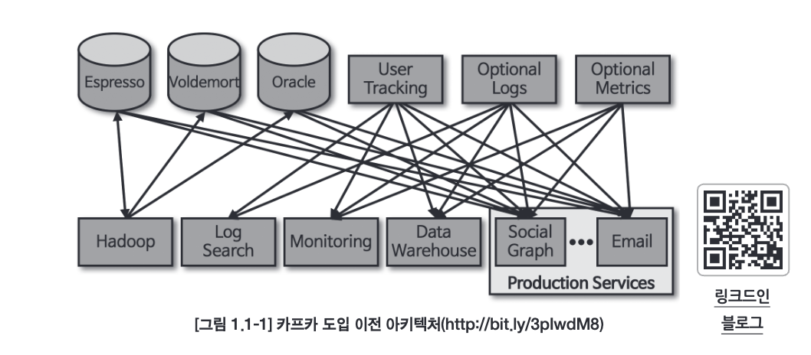
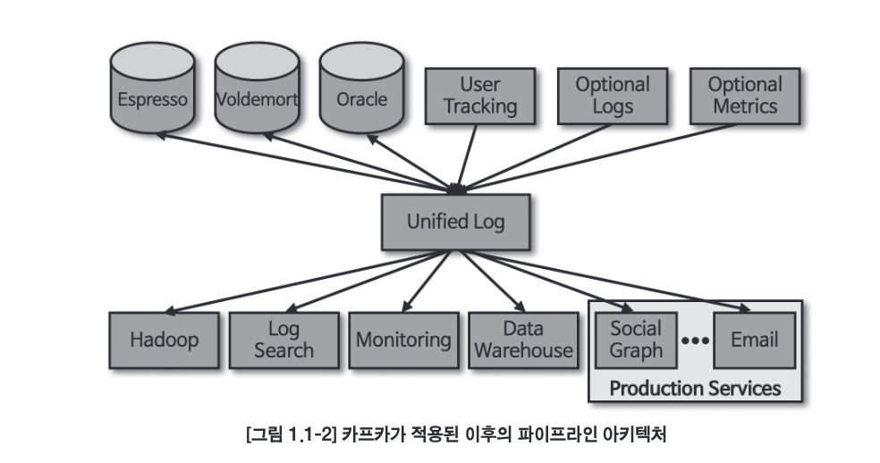
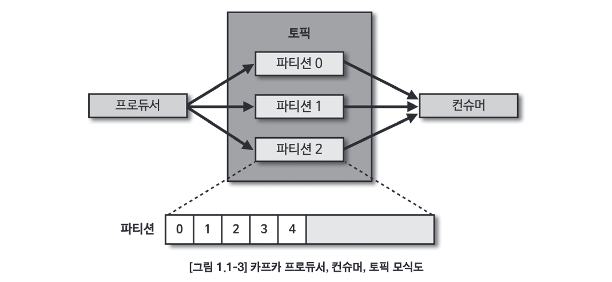
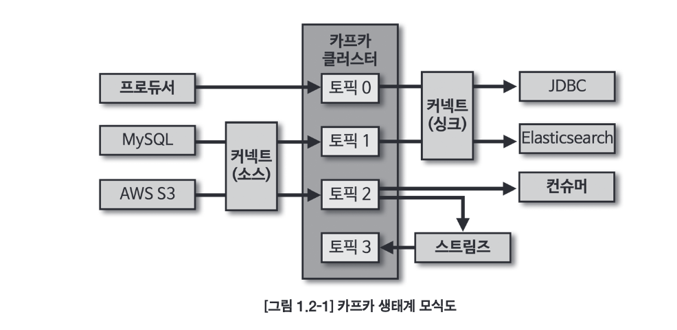
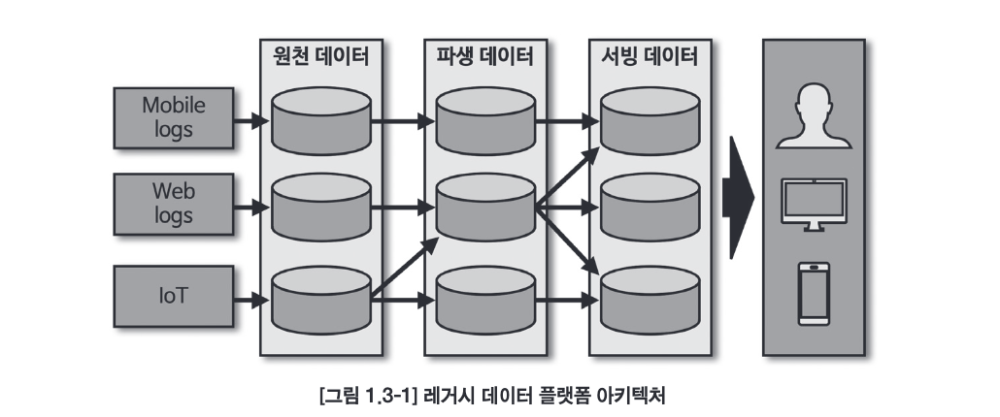
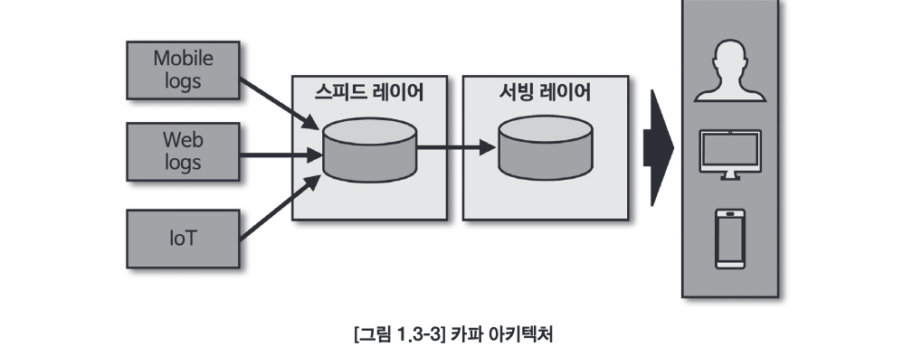
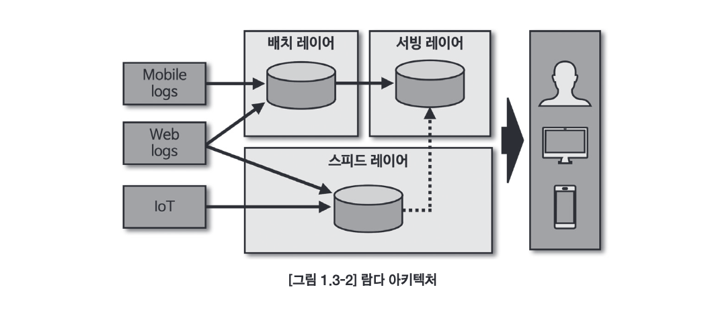
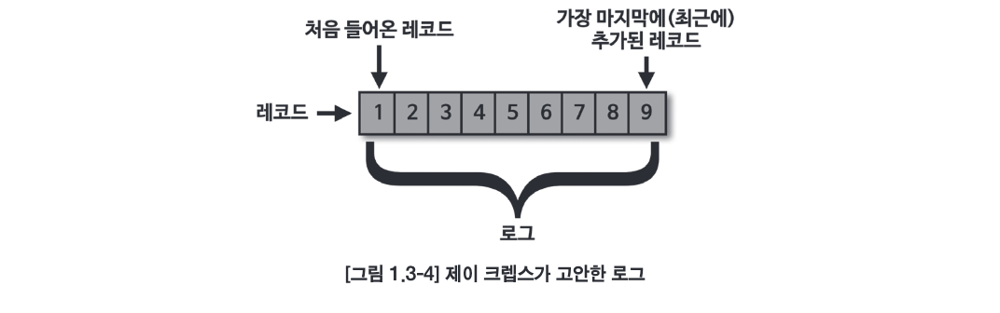
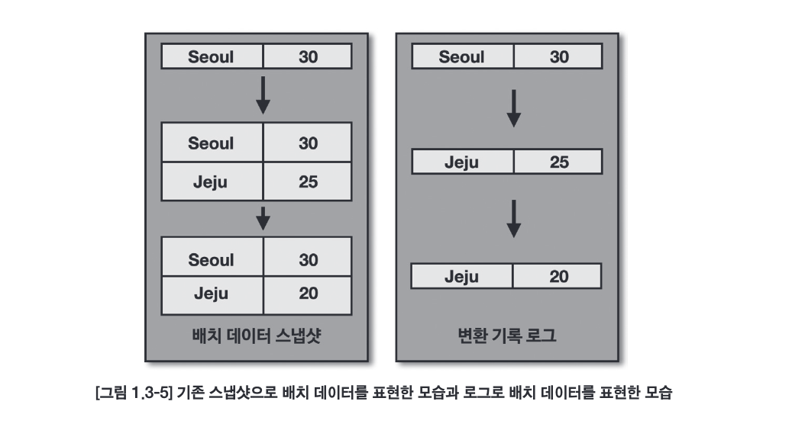
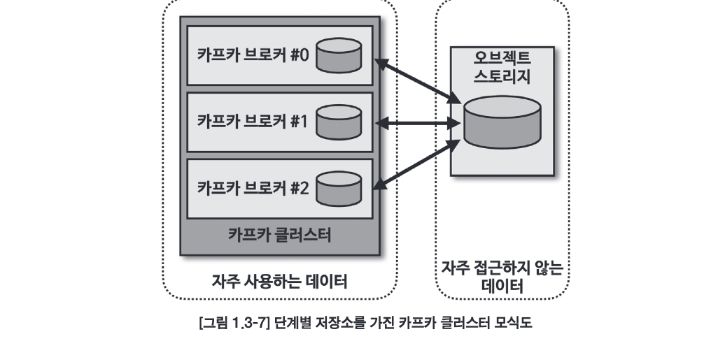

# Chapter 01. 들어가며

## 1.1 카프카의 탄생
- 링크드인 아키텍처가 거대해지면서 소스 애플리케이션과 타깃 애플리케이션을 연결하는 파이프라인 개수가 많아짐 -> 소스코드 및 버전 관리 이슈

- 다양한 메시징 플랫폼과 ETL(Extract Trnasform) 툴을 적용하여 아키텍처를 변경하려고 노력헀지만 파편화된 데이터 파이프라인의 복잡도를 낮춰주는 아키텍처가 되지는 못했다.
  
    ➡️ 결국 만들어낸 신규 시스템이 바로 `아파치 카프카`

- 카프카는 각각의 애플리케이션끼리 연결하여 데이터를 처리하는 것이 아니라 한 곳에 모아 처리할 수 있도록 중앙집중화했다.
- 카프카를 통해 웹사이트, 애플리케이션, 센서 등에서 취합한 데이터 스트림을 한 곳에서 실시간으로 관리할 수 있게 됨
  - 카프카가 일종의 중추 신경
- 카프카를 중앙에 배치함으로써 소스 애플리케이션과 타깃 애플리케이션 사이의 의존도를 최소화
- 카프카 내부에 데이터가 저장되는 파티션의 동작은 FIFO(First In First Out) 방식의 큐 자료구조와 유사하다. 큐에 데이터를 보내는 것이 '프로듀서'이고, 데이터를 가져가는 것이 '컨슈머'이다.

- 카프카를 통해 전달할 수 있는 데이터 포맷은 사실상 제한 X
  - 자바에서 선언 가능한 모든 객체 지원
  - 카프카 클라이언트에서 기본적으로 ByteArray, ByteBuffer, Double, Long, String 타입에 대응한 직렬화, 역직렬화 클래스가 제공됨
  - 상용 환경에서 카프카는 최소 3대 이상의 서버(브로커)에서 분산 운영하여 프로듀서를 통해 전송받은 데이터를 파일 시스템에 안정하게 기록
    - 서버 3대 이상으로 이루어진 카프카 클러스터 중 일부 서버에 장애가 발생하더라도 데이터를 지속적으로 복제하기 때문에 안전하게 운영 가능
- 카프카는 2011년 초에 오픈소스화 됨 (https://github.com/apache/kafka)

## 1.2 빅데이터 파이프라인에서 카프카의 역할

- 수십 테라바이트가 넘어가는 방대한 양의 데이터를 기존의 데이터베이스로 관리하는 것은 불가능에 가깝다.
- 빅데이터를 저장하고 활용하기 위해서는 일단 생성되는 데이터를 모두 모으는 것이 중요한데, 이 때 사용되는 개념이 `데이터 레이크(data lake)`이다.
  - `데이터 레이크` : 데이터가 모이는 저장공간 (필터링되거나 패키지화되지 않은 데이터가 저장됨)
- 서비스에서 발생하는 데이터를 데이터 레이크레 직접 엔드 투 엔드 방식으로 넣을 수도 있지만, 서비스가 비대해지면서 복잡도가 올라감
  ➡️ 데이터를 추출하고 변경, 적재하는 과정을 묶은 `데이터 파이프라인`을 구축해야 한다.
- `데이터 파이프라인` : 엔드 투 엔드 방식의 데이터 수집 및 적재를 개선하고 안정성을 추구하며, 유연하면서도 확장 가능하게 자동화한 것
- 데이터 파이프라인을 안정적이고 확장성 높게 운영하기 위한 좋은 방법 중 하나가 바로 아파치 카프카를 이용하는 것
  - **높은 처리량** 
    - 프로듀서가 브로커로 데이터를 보낼 때와 컨슈머가 브로커로부터 데이터를 받을 때 모두 묶어서 전송
    - 많은 양의 데이터를 묶음 단위로 처리하는 배치로 빠르게 처리
    - 파티션 단위를 통해 동일 목적의 데이터를 여러 파티션에 분배하고 데이터를 병렬 처리 가능
  - **확장성**
    - 데이터가 적을 때는 브로커를 최소한의 개수로 운영하다가 데이터가 많아지면 클러스터의 브로커 개수를 자연스럽게 늘려 스케일 아웃(scale-out)할 수 있다.
    - 반대로 데이터가 적어지고 추가 서버들이 더는 필요없어지면 브로커 개수를 줄여 스케일 인(scale-in)할 수 있다.
    - 스케일 아웃, 스케일 인 과정은 클러스트의 무중단 운영을 지원
  - **영속성**
    - 영속성 : 데이터를 생성한 프로그램이 종료되더라도 사라지지 않은 데이터의 특성
    - 카프카는 다른 메시징 플랫폼과 다르게 전송받은 데이터를 메모리에 저장하지 않고 **파일 시스템**에 저장
    - 운영체제에서는 파일 I/O 성능 향상을 위해 페이지 캐시 영역을 메모리에 따로 생성하여 사용하므로 파일 시스템에 저장하더라도 처리량이 높음
  - **고가용성**
    - 3개 이상의 서버들로 운영되는 카프카 클러스터는 일부 서버에 장애가 발생하더라도 무중단으로 안전하고 지속적으로 데이터 처리 가능
    - 클러스터로 이루어진 카프카는 데이터 복제(replication)을 통해 고가용성의 특징을 갖게됨
    - 프로듀서로 전송받은 데이터를 1대의 브로커에만 저장하는 것이 아니라 또 다른 브로커에도 저장

> [!NOTE]
> **카프카 클러스터를 3대 이상의 브로커들로 구성해야 하는 이유**
> 
> - 보통 1대만 운영할 경우 브로커의 장애는 서비스의 장애로 이어지므로 테스트 목적으로만 사용
> - 2대로 운영할 경우 한 대의 브로커에 장애가 발생하더라도 나머지 한 대 브로커가 살아 있으므로 안정적으로 데이터 처리 가능하지만 브로커 간에 데이터가 복제되는 시간 차이로 일부 데이터 유실 가능
> - 유실을 막기 위해 min, insync, replicas 옵션을 사용하는데 이 옵션을 2로 설정하면 최소 2개 이상의 브로커에 데이터가 완전히 복제됨을 보장한다. 
> - 이 옵션을 2로 설정하면 브로커를 3대 이상으로 운영해야 한다.

## 1.3 데이터 레이크 아키텍처와 카프카의 미래

- 데이터 레이크 아키텍처 종류 2가지
  - 람다 아키텍처
  - 카파 아키텍처
- 초기 아키텍처
  - 엔드 투 엔드로 각 서비스 애플리케이션으로부터 데이터를 배치로 모음
  
  - 원천 데이터로부터 파생된 데이터의 히스토리 파악이 어럽고 계속되는 데이터의 가공으로 인해 데이터 표준 및 정책(데이터 거버넌스)를 지키기 어려웠음
- 람다 아키텍처
  - 기존의 배치 데이터를 처리하는 부분 외에 스피드 레이어라고 불리는 실시간 데이터 ETL 작업 영역을 정의한 아키텍처 생성
  
  - 데이터를 배치 처리하는 레이어와 실시간 처리하는 레이어를 분리
  - 3가지 레이어
    - 배치 레이어 : 배치 데이터를 모아서 특정 시간, 타이밍마다 일괄 처리
    - 서빙 레이어 : 가공된 데이터를 데이터 사용자, 서비스 애플리케이션이 사용할 수 있도록 데이터가 저장된 공간
    - 스피드 레이어 : 서비스에서 생성되는 원천 데이터를 실시간으로 분석 (짧은 지연 시간)
      - 여기서 분석되는 건 사용자 또는 서비스에서 직접 사용할 수 있지만 필요한 경우에 서빙 레이어로 보내서 저장하고 사용할 수 있음
      - **여기에 카프카가 존재**
      - 그러나 데이터를 분석, 처리하는 데에 필요한 로직이 2벌로 각각의 레이어에 따로 존재해야 한다는 점과 배치 데이터와 실시간 데이터를 융합 처리할 때 유연하지 못한 파이프라인을 생성해야 한다는 단점
- 카파 아키텍처
  - 람다 아키텍처에서 배치 레이어를 제거하고 모든 데이터를 스피드 레이어에 넣어서 처리!
    
  - 그런데 **스피드 레이어에서 모든 데이터를 처리하므로 생성되는 모든 종류의 데이터를 스트림 처리해야 한다.**

- 배치 데이터를 어떻게 스트림 프로세스로 처리할 수 있게 된 것일까?
  - 모든 데이터를 로그로 바라보는 것에서 시작
    - 이 떄 로그는 애플리케이션 로깅하는 그 로그 아니고 데이터의 집합을 뜻함
    - 이 데이터는 지속적으로 추가가 가능하며 각 데이터에는 일정한 번호가 붙음
  - 
- 로그는 배치 데이터를 스트림으로 표현하기에 적합하다. 일반적으로 데이터 플랫폼에서 배치 데이터를 표현할 때는 각 시점(시간별 일자별 등)의 전체 데이터를 백업한 스냅샷 데이터를 뜻했으나 대치 데이터를 로그로 표현할 때는 각 시점의 배치 데이터 변환 기록을 시간 순서대로 기록함으로써 각 시점의 모든 스냅샷 데이터를 저장하지 않고도 배치 데이터를 표현할 수 있게 되었다.
  
- 로그로 배치 데이터와 스트림 데이터를 저장하고 사용하기 위해서는 변환 기록이 일정 기간 동안 삭제되어서는 안 되고 지속적으로 추가되어야 한다. 그리고 서비스에서 생성된 모든 데이터가 스피드 레이어에 들어오는 것을 감안하면 스피드 레이어를 구성하는 데이터 플랫폼은 SPOF(Single Point Of Failure)가 될 수 있으므로 반드시 내결함성과 장애 허용 특성을 지녀야 했다.
- 아파치 카프카는 이러한 특징에 정확히 부합하는 플랫폼
- 요즘은 굳이 서빙 레이어의 저장소에 다시 저장할 필요가 없고 거대한 용량의 데이터를 오랜 기간 저장하고 사용할 수 있다면 서빙 레이어는 제거되어도 된다는 스트리밍 데이터 레이크 아키텍처가 제안됨
  
  - 아직은 카프카를 스트리밍 데이터 레이크로 사용하기 위해서 개선해야 하는 부분이 있음
  - 자주 접근하지 않는 데이터는 저렴하고 안전한 저장소에 옮겨 저장하고 자주 사용하는 데이터만 브로커에서 사용하는 구분 작업 필요
  
  - 그리고 데이터를 사용하는 고객이나 서비스 애플리케이션에서 카프카의 데이터를 쿼리할 수 있는 주변 데이터 플랫폼이 필요하다.
    - 컨플루언트(Confluent) : 카프카의 데이터를 SQL 기반으로 조회 가능하도록 함
    - 카프카 + ksqlDB 형태가 스트리밍 데이터 레이크에 가장 근접한 모습이지만 아직 배치 데이터 완벽히 처리하기는 부족함