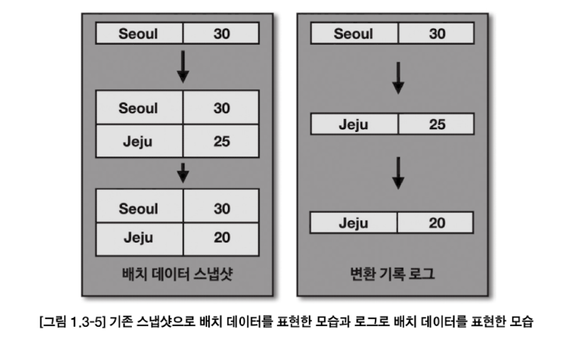

# Chapter 1. 들어가며

## 1.1. 카프카의 탄생
- 카프카는 각각의 애플리케이끼리 연결하여 데이터를 처리하는 것이 아니라 한 곳에 모아 처리할 수 있도록 `중앙집중화` 했다.
  - 카프카를 통해 웹사이트, 애플리케이션, 센서 등에서 취합한 데이터 스트림을 한 곳에서 실시간 관리할 수 있게 되었다

- 카프카를 중앙에 배치 > 소스 애플리케이션과 타깃 애플리케이션 간의 **의존도 최소화** -> 커플링 완화
- 직렬화, 역직렬화를 통해 ByteArray 로 통신하기에 자바에서 선언 가능한 모든 객체는 카프카를 통해 전달할 수 있다

## 1.2. 빅데이터 파이프라인에서 카프카의 역할
### 높은 처리량
- 카프카는 프로듀서가 브로커로 데이터를 보낼 때, 컨슈머가 브로커로부터 데이터를 받을 때 **모두 묶어서 전송한다**
  - 동일한 양의 데이터 전송 시 네트워크 통신 횟수를 최소한으로 줄이면 동일 시간 내에 더 많은 데이터를 전송할 수 있다.
- 파티션 단위를 통해 동일 목적의 데이터를 여러 파티션에 분배하고 **데이터를 병렬 처리할 수 있다. 파티션 개수만큼 컨슈머 개수를 늘려 동일 시간당 데이터 처리량을 늘리는 것이다**
> 💡 ex. 주문 생성 이벤트가 초당 수천 건 → 32개 파티션으로 분산 → 컨슈머 32개 → 병렬로 32배 처리
> - 한 파티션은 여러 컨슈머가 같은 그룹에서 동시 소비 불가
> - 한 파티션을 여러 컨슈머가 다른 그룹에서 동시 소비 가능
> - 컨슈머는 여러 개의 파티션 소비 가능

### 확장성
- 데이터 양에 따라 카프카 클러스터의 브로커 개수를 스케일 인/아웃 할 수 있다

### 영속성
- 카프카는 타 메시징 플랫폼과 다르게 전송받은 데이터를 메모리에 저장하지 않고 파일시스템에 저장한다
  - 파일시스템에 데이터를 적재하고 사용하는 것은 보편적으로 느리다고 생각된다.
  - 하지만 운영체제 레벨에서 파일 I/O 성능 향상을 위해 `페이지 캐시` 영역을 메모리에 따로 생성하여 사용한다.
  - **페이지 캐시 메모리 영역을 사용하여 한번 읽은 파일 내용은 메모리에 저장했다가 재사용하는 방식**이기에 카프카가 파일 시스템을 사용하더라도 처리량이 높은 것이다

### 고가용성
- 클러스터로 이루어진 카프카는 데이터 복제를 통해 고가용성을 달성했다
  - 프로듀서로 전송받은 데이터를 여러 브로커 중 **1대의 브로커에만 저장하는 것이 아니라 또 다른 브로커에도 저장하는 것이다**
- **카프카 클러스터를 3대 이상의 브로커들로 구성해야 하는 이유**
  - 1대 : SPOF 발생 가능성
  - 2대 : 한 브로커 장애날 경우 브로커 간 데이터가 복제되는 시간 차이로 인해 일부 데이터 유실 가능성 존재
    - 유실을 막기 위해 min.insync.replicas = 2로 설정하면 '최소 2개 이상' 의 브로커에 데이터가 완전히 복제됨을 보장한다
    - 이 옵션을 2로 사용할 때는 브로커를 3대 이상으로 운영해야만 한다

## 1.3. 데이터 레이크 아키텍처와 카프카의 미래
- 배치 데이터 : 초, 분, 시간, 일 등으로 한정된 데이터로 일괄 처리하는 것이 특징이다
- `스트림` 데이터 : **한정되지 않은 데이터**로, 시작 데이터 / 끝 데이터가 명확히 정해지지 않은 데이터
  - ex. 웹 사용자의 클릭 로그, 주식 정보, 사물 인터넷의 센서 데이터
- 배치를 스트림 프로세스로 처리할 수 있게 된 배경에는 `모든 데이터를 로그 (데이터 집합) 으로 바라보는 것)` 에서 시작되었다
  - 
  - 
    - 배치 데이터를 로그로 표현할 때는 **각 시점의 배치 데이터의 변환 기록을 시간순으로 기록함**으로써, 각 시점의 모든 스냅샷을 저장하지 않아도 배치 데이터 표현 가능.
- 카프카 클러스터에서 자주 접근하지 않는 데이터는 오브젝트 스토리지와 같이 저렴하고 안전한 저장소에 옮겨 저장하고, 자주 사용하는 데이터만 브로커에서 사용하는 구분 작업이 필요하다
    