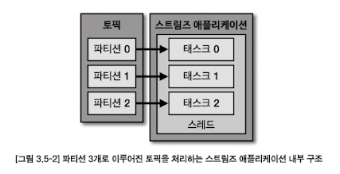

# Chapter 3. 카프카 기본 개념 설명

## 3.1. 카프카 브로커, 클러스터, 주키퍼
- 카프카 브로커 : 카프카 클라이언트와 데이터를 주고받기 위해 사용하는 주체
- 데이터를 안전하게 보관, 처리하기 위해 **3대 이상의 브로커 서버를 1개의 클러스터로 묶어서 운영한다**
- 카프카 클러스터로 묶인 브로커들은 프로듀서가 보낸 데이터를 안전하게 분산 저장 및 복제하는 역할을 수행한다

### 데이터 저장, 전송
- 카프카는 `페이지 캐시` 를 사용해서 디스크 입출력 속도를 높여 파일 시스템의 처리 속도가 느린 문제를 해결했다
  - 페이지 캐시 : OS 에서 파일 입출력의 성능 향상을 위해 만들어 놓은 `메모리` 영역
  - 한번 읽은 파일 내용은 메모리의 페이지 캐시 영역에 저장한다. <br>
  추후 동일 파일 접근이 일어나면 **디스크에서 읽지 않고 메모리에서 직접 읽는다.**

### 데이터 복제, 싱크
- 카프카 데이터 복제는 `파티션` 단위로 이루어진다
- 복제 개수 최솟값은 1 (복제 없음), 최댓값은 브로커 개수만큼 설정가능
- 복제 개수가 3인 경우

- 복제된 파티션은 `리더` 와 `팔로워` 로 구성된다
    - 리더 : 프로듀서 또는 컨슈머와 직접 통신하는 파티션
    - 팔로워 : 나머지 복제 데이터를 가지고 있는 파티션
      - 리더 파티션의 오프셋을 확인하여, 현재 자신이 가진 오프셋과 차이가 나면 리더 파티션으로부터 데이터를 가져와서 자신의 파티션에 저장 => 복제
      - 복제 개수만큼 저장용량이 증가한다는 단점 vs. 데이터를 안전하게 사용할 수 있다는 강력한 장점

### 컨트롤러(controller)
- 컨트롤러는 다른 브로커들의 상태를 체크하고, 브로커가 클러스터에서 빠지는 경우 해당 브로커에 존재하는 리더 파티션을 분배한다

### 데이터 삭제
- 카프카는 타 메시징 플랫폼과 달리, 컨슈머가 데이터를 가져가도 토픽의 데이터는 삭제되지 않으며 컨슈머/프로듀서가 데이터 삭제를 요청할 수도 없으며 **오직 브로커만이 데이터를 삭제할 수 있다**


### 컨슈머 오프셋 저장
- 컨슈머 그룹은 토픽이 특정 파티션으로부터 데이터를 가져가서 처리하고 **파티션의 어느 레코드까지 가져간지 확인하기 위해 오프셋을 커밋한다**
  - 여기서 저장된 오프셋을 토대로, 컨슈머 그룹은 다음 레코드를 가져가 처리한다

### 코디네이터(coordinator)
- 클러스터의 **다수 브로커 중 한 대는 코디네이터 역할을 수행한다**
  - 코디네이터 : **컨슈머 그룹의 상태를 체크, 파티션을 컨슈머와 매칭되도록 분배**
    - 컨슈머가 컨슈머 그룹에서 빠지면, 매칭되지 않은 파티션을 정상 동작하는 컨슈머로 할당하여 끊임없이 데이터 처리되도록 도움
    - 리밸런스 : 파티션을 컨슈머로 재할당하는 과정
- 주키퍼 : 카프카의 메타데이터를 관리하는데에 사용됨
- __consumer__offsets 토픽 : 카프카 내부에서 컨슈머 오프셋을 저장하기 위한 용도로 사용되는 토픽

- 카프카 클러스터로 묶인 브로커들은 동일한 주키퍼 경로 (zookeeper.connect 옵션) 를 사용해야 하며, 그렇게 해야 주키퍼가 같은 카프카 클러스터에 속한 브로커들로 인식한다. 

## 3.2. 토픽과 파티션
- 토픽 : 카프카에서 데이터를 구분하기 위해 사용하는 단위
- 파티션은 카프카의 `병렬 처리의 핵심` 으로써, 그룹으로 묶인 컨슈머들이 레코드를 병렬로 처리할 수 있도록 매칭됨
- 컨슈머 처리가 한정된 상황에서, 컨슈머 개수 + 파티션 개수를 늘리면 스케일 아웃 가능
- 파티션의 레코드는 **컨슈머가 가져가는 것과 별개로 관리되므로, 다양한 목적을 가진 여러 컨슈머 그룹들이 토픽의 데이터를 여러 번 가져갈 수 있다**


|항목|가능 여부|
|------|---|
|하나의 파티션을 여러 컨슈머가 읽기 (같은 group)	|❌	불가능 |
|하나의 파티션을 여러 컨슈머가 읽기 (다른 group)	|✅	가능|
|하나의 컨슈머가 여러 파티션을 소비	|✅	일반적인 구조|

## 3.3. 레코드
- 레코드
  - 타임스탬프, 메시지 키, 메시지 값, 오프셋, 헤더로 구성
- 타임스탬프
  - 프로듀서에서 해당 레코드가 생성된 시점의 유닉스 타임이 결정됨
- 메시지 키
  - 메시지 키를 사용하면 프로듀서가 토픽에 레코드를 전송할 때 **메시지 키의 해시값을 토대로 파티션을 지정**하게 된다.
    - 즉, **동일한 메시지 키라면 동일 파티션에 들어가게 된다.**
  - 메시지키가 null 로 설정된 레코드는 프로듀서 기본 설정 파티셔너에 따라서 파티션에 분배되어 저장된다.

  > ```java
  > public CompletableFuture<SendResult<K, V>> send(String topic, K key, @Nullable V data)
  > ```
  > - 여기서 K key는 Kafka 메시지의 "Key", 즉 파티션을 결정짓는 기준이 되는 메시지 키
  > - 메시지키를 랜덤값으로 사용할 경우 **의도적으로 랜덤 파티션 분산이 가능**하다

- 메시지 값
   - 실질적으로 처리할 데이터가 들어있으며, **메시지 키와 메시지 값은 직렬화**되어 (ex. ProducerRecord / ConsumerRecord) 브로커로 전송되기 때문에 컨슈머가 이용할 때는 직렬화한 형태와 동일한 형태로 역직렬화를 수행해야 한다. 
- 레코드 오프셋
  - 0 이상의 숫자로, 직접 지정할 수 없고 **브로커에 저장될 때 이전에 전송된 레코드의 오프셋+1 값으로 생성된다.**
  - 오프셋을 사용하면 컨슈머 그룹으로 이루어진 카프카 컨슈머들이 파티션의 데이터를 어디까지 가져갔는지 명확히 지정할 수 있다.
```json
Record = {
  topic: "example-topic",
  partition: 0,
  offset: 12345,
  timestamp: 1680000000000,
  key: "some-key",
  value: "some-value",
  headers: [ { key: "correlation-id", value: "abc123" } ]
}
```

## 3.4. 카프카 클라이언트
### 3.4.1. 프로듀서 API
- 프로듀서는 데이터를 전송할 때 **리더 파티션을 가지고 있는 카프카 브로커와 직접 통신**한다

#### 카프카 프로듀서 프로젝트 생성
```java
KafkaProducer<String, String> producer = new KafkaProducer<String, String>(configs);

String messageKey = "key1";
String messageValue = "testMessage";
ProducerRecord<String, String> record = new ProducerRecord(TOPIC_NAME, messageKey, messageValue);
producer.send(record); // A
producer.flush(); // B
```
- A: send() 메서드는 즉각적인 전송을 뜻하는 것이 아니라, **파라미터로 들어간 record를 프로듀서 내부에 가지고 있다가, 배치 형태로 묶어서 브로커에 전송**한다. 
  - 이러한 전송 방식을 '배치 전송' 이라고 부른다. 
  - 배치 전송을 통해 카프카는 타 메시지 플랫폼과 차별화된 전송 속도를 가지게 되었다.
- B: flush() 메서드는 **프로듀서 내부 버퍼에 가지고 있던 레코드 배치를 브로커로 전송**한다.

#### 프로듀서 중요 개념

- KafkaProducer 인스턴스가 `send()` 메서드를 호출하면, ProducerRecord는 **파티셔너(partitioner)에서 토픽의 어느 파티션으로 전송될 것인지 정해진다.**
- 파티셔너에 의해 구분된 레코드는 데이터를 전송하기 전에 **어큐뮬레이터(accumulator)에 데이터를 버퍼로 쌓아놓고 발송**한다.
  - 버퍼로 쌓인 데이터는 **배치**로 묶어서 전송함으로써 카프카의 프로듀서 처리량을 향상시키는데 도움을 준다.
- 카프카 클라이언트 라이브러리 2.5.0 버전에서 파티셔너를 지정하지 않은 경우 UniformStickyPartitioner 가 기본 파티셔너로 설정된다.
  - UniformStickyPartitioner, RoundRobinPartitioner 파티셔너의 공통점 : 메시지 키가 있을 때는 메시지 키의 해시값과 파티션을 매칭하여 데이터를 전송한다는 점이다.
- 카프카 2.4.0 이전에는 RoundRobinPartitioner가 기본 파티셔너로 설정되어 있었다.
  - **ProducerRecord가 들어오는 대로 파티션을 순회하면서 전송하기 때문에 배치로 묶이는 빈도가 적다.**
  - 될 수 있으면 많은 데이터가 배치로 묶여 전송되어야 성능 향상을 기대할 수 있으므로, 카프카 2.4.0부터는 UniformStickyPartitioner가 기본 파티셔너로 설정되었다.
- UniformStickyPartitioner
  - 프로듀서 동작에 특화되어 높은 처리량과 낮은 리소스 사용률을 가진다.
  - **어큐뮬레이터에서 데이터가 배치로 모두 묶일 때까지 기다렸다가 배치로 묶인 데이터는 모두 동일한 파티션에 전송**함으로써 RoundRobinPartitioner에 비해 향상된 성능을 가지게 되었다.
- Partitioner 인터페이스를 상속받은 사용자 정의 클래스에서 메시지 키 또는 메시지 값에 따라 파티션 지정 로직을 지정할 수 있다.
> 그러나, 카프카 버전 3.3 부터는 DefaultPartitioner, UniformStickyPartitioner는 deprecated됨
- 프로듀서는 압축 옵션을 통해 브로커로 전송 시 압축 방식을 정할 수 있다. ex) gzip, snappy, lz4, zstd 를 지원
- 압축을 하면 데이터 전송 시 네트워크 처리량에 이득을 볼 수 있지만, 압축을 하는데에 CPU 나 메모리 리소스를 사용하므로 사용환경에 따라 적절한 압축 옵션을 사용하는 것이 중요하다.

#### 프로듀서 주요 옵션
- 필수 옵션
  - `bootstrap.servers` : 프로듀서가 데이터를 전송할 대상 카프카 클러스터에 속한 브로커의 호스트 이름:포트 를 1개 이상 작성
  - `key.serializer` : 레코드의 메시지 키를 직렬화하는 클래스
  - `value.serializer` : 레코드의 메시지 값을 직렬화하는 클래스
- 선택 옵션
  - `acks` : 프로듀서가 전송한 데이터가 **브로커들에 정상적으로 저장되었는지 전송 성공 여부를 확인하는데 사용하는 옵션**
    - 1 : 기본값. 리더 파티션에 데이터가 저장되면 전송 성공으로 판단.
    - 0 : 프로듀서가 전송한 즉시, 브로커에 데이터 저장 여부 상관없이 성공으로 판단.
    - -1 (all) : 토픽의 min.insync.replicas 개수에 해당하는 리더 파티션, 팔로워 파티션에 데이터가 저장되면 성공으로 판단.
  - `buffer.memory` : 브로커로 전송할 데이터를 배치로 모으기 위해 설정할 버퍼 메모리양 지정. 기본값은 32MB(33554432)
  - `retries` : 프로듀서가 브로커로부터 에러를 받고 난 뒤 재전송 시도 횟수. 기본값은 2147483647
  - `batch.size` : 배치로 전송할 레코드 최대 용량. 너무 작게 설정하면 프로듀서가 브로커로 더 자주 보내기 때문에 네트워크 부담이 있고, 너무 크게 설정하면 메모리를 더 많이 사용하게 되는 점을 주의. 기본값은 16384.
  - `linger.ms` : 배치를 전송하기 전까지 기다리는 최소 시간. 기본값은 0.
  - `partitioner.class` : 레코드를 파티션에 전송할 때, 적용하는 파티션 클래스 지정. 기본값은 DefaultPartitioner
  - `enable.idempotence` : 멱등성 프로듀서로 동작할 지 여부 설정. 기본값 false.
  - `transactional.id` : 프로듀서가 레코드를 전송할 때, 레코드를 트랜잭션 단위로 묶을지 설정. 프로듀서의 고유한 트랜잭션 id를 설정할 수 있다. 이 값을 설정하면 트랜잭션 프로듀서로 동작한다.

#### 브로커 정상 전송 여부를 확인하는 프로듀서
- KakfaProducer.send() 메서드는 Future 객체를 반환하는데, 이는 RecordMetatdata 의 비동기 결과를 표현한다
- send() 의 결과값은 **카프카 브로커로부터 응답을 기다렸다가, 브로커로부터 응답이 오면 RecordMetatdata 인스턴스를 반환**한다
- 프로듀서는 비동기로 결과를 확인할 수 있도록 callback 인터페이스를 제공한다. 따라서 비동기로 결과를 받으려면 ProducerRecord 객체와 함께 사용자 정의 callback 클래스를 넣으면 된다
  ```java
  // kafkaTemplate
  Future<RecordMetadata> sendFuture = producer.send(producerRecord, this.buildCallback(producerRecord, producer, future, sample, observation));
  ```

## 3.4.2. 컨슈머 API
### 카프카 컨슈머 프로젝트 생성
- 컨슈머 그룹을 통해 `컨슈머 목적` 을 구분할 수 있다
  - 동일한 역할을 하는 컨슈머를 묶어 관리 가능
  - **컨슈머 그룹 기준으로 컨슈머 오프셋을 관리**하므로 subscribe() 메서드를 사용하여 토픽 구독할 때는 컨슈머 그룹을 선언해야 한다
  - **컨슈머 중단, 재시작되더라도 컨슈머 그룹의 컨슈머 오프셋을 기준으로 이후 데이터 처리**를 하기 때문
  - 컨슈머 그룹 미선언 시 어떤 그룹에도 속하지 않는 컨슈머로 동작
- 컨슈머에게 토픽을 할당하기 위해 subscribe() 메서드 사용
  ```java
  KafkaConsumer<String, String> consumer = new KafkaConsumer<>(configs);
  consumer.subscribe(Arrays.asList(TOPIC_NAME));
  ```
- 컨슈머는 poll() 메소드를 호출하여 데이터 가져와 처리. 지속적으로 데이터를 처리하기 위해서는 반복 호출 필요
  ```java
  while(true) {
    ConsumerRecords<String, String> records = consumer.poll(Duration.ofSeconds(1));
    ...
  }
  ```
  - poll() 메서드의 Duration 타입 인자는, 브로커로부터 데이터를 가져올 때 **컨슈머 버퍼에 데이터를 기다리기 위한 타임아웃 간격**을 의미한다
  > ❓ 컨슈머 버퍼

### 컨슈머 중요 개념
- 토픽의 파티션으로부터 데이터를 가져가기 위해 컨슈머 운영하는 방법
  - 1개 이상의 컨슈머로 이루어진 **컨슈머 그룹** 운영하기
  - 토픽의 **특정 파티션만 구독하는 컨슈머** 운영하기
- 컨슈머 그룹으로 묶인 컨슈머들은 토픽의 1개 이상 파티션들에 할당되어 데이터를 가져갈 수 있다
 
- **1개의 파티션은 최대 1개의 파티션에만 할당 가능하며, 1개 컨슈머는 여러 파티션에 할당될 수 있다**
- 컨슈머 그룹의 컨슈머 개수 <= 가져가고자 하는 토픽의 파티션 개수 여야 함
  - 그 이유는 **파티션을 할당받지 못한 컨슈머는 스레드만 차지하고 실질적 데이터 처리 못함** => 애플리케이션 실행에 있어 불필요한 스레드로 남음
- 컨슈머 그룹은 다른 컨슈머 그룹과 격리되는 특성이 있어, 카프카 프로듀서가 보낸 데이터를 각기 다른 역할을 하는 컨슈머그룹끼리 영향 받지 않게 처리할 수 있다
  - ex. 데이터 파이프라인을 운영함에 있어 적절히 컨슈머 그룹을 분리하여 운영하는 것은 매우 중요
- `리밸런싱` : 일부 컨슈머에 장애가 발생하면, 장애가 발생한 컨슈머에 할당된 파티션은 장애가 발생하지 않은 컨슈머에 소유권이 넘어감
  - 가용성을 높이면서 안정적 운영을 도와주지만 자주 일어나서는 안된다
  - 리밸런싱 발생 시, **파티션의 소유권을 컨슈머로 재할당하는 과정에서 해당 컨슈머 그룹의 컨슈머들이 토픽의 데이터를 읽을 수 없기 때문이다**
    > Kafka는 리밸런싱 과정에서 "이 파티션의 소유자는 누구인가?"를 다시 결정한다. <br>
  이 과정이 진행되는 동안에는 **해당 파티션을 읽을 수 있는 컨슈머가 일시적으로 존재하지 않게 되어,
  리밸런싱이 완료될 때까지 데이터 소비가 중단**된다.
  - `그룹 조정자 (group coordinator)` 는 컨슈머 그룹의 컨슈머 추가, 삭제를 감지하여 리밸런싱을 발동시키는 역할을 한다
  - 카프카 브로커 중 한 대가 그룹 조정자 역할을 수행한다
  
    > 컨슈머 그룹마다 하나의 Group Coordinator가 존재하며, 브로커 중 하나가 이 역할을 담당한다. <br>여러 컨슈머 그룹이 있을 경우, 각각 다른 브로커가 Coordinator가 될 수 있다.
- 컨슈머는 카프카 브로커로부터 데이터를 어디까지 가져갔는지 `커밋` 을 통해 기록한다
  - 카프카 브로커 내부에서 사용되는 내부 토픽 (__consumer_offsets) 에 '**특정 토픽의 파티션을 어떤 컨슈머 그룹이 몇 번째 가져갔는지**' 저장
  - 이 토픽에 오프셋 커밋이 기록되지 못하면, 데이터 처리 중복 발생 가능성 있음
  
- 명시적 / 비명시적 오프셋 커밋
  - 기본 옵션 : poll() 메소드 수행될 때 일정 간격마다 오프셋 커밋하도록 enable.auto.commit = true 로 설정 <br> → 비명시 '오프셋 커밋' : 일정 간격마다 자동 커밋
    - auto.commit.interval.ms 설정값과 함께 사용되며, poll() 메서드가 해당 설정값 이상이 지났을 때 그 시점까지 읽은 레코드의 오프셋을 커밋한다
  - 비명시적 오프셋 커밋은 편리하지만, poll() 메서드 호출 이후 리밸런싱 or 컨슈머 강제 종료 발생 시, 컨슈머가 처리하는 데이터 중복 또는 유실 가능성이 있음
  - 명시적으로 오프셋 커밋하고 싶다면, poll() 메서드 호출 이후 **반환받은 데이터 처리가 완료되고 commitSync() 메서드를 호출하면 됨**
    - commitSync(): 브로커에 커밋 요청하고, 커밋 정상 처리되었는지 응답하기까지 기다림. → 컨슈머 처리량에 영향을 끼침
    - commitAsync(): 커밋 요청을 전송하고 응답 오기 전까지 데이터 처리 수행 가능. 하지만 커밋 요청 실패 시, 현재 처리 중인 데이터 순서 보장하지 못하며, 데이터 중복 처리 발생 가능
> ✅ **프로젝트 구조 뜯어보기**
> - ack-mode : manual
>   - 매번 acknowledge() 메서드를 호출하면 BATCH 옵션과 동일하게 동작한다.
>   - 이 옵션을 사용할 경우에는 AcknowledgingMessageListener 또는 BatchAcknowledgingMessageListener를 리스너로 사용해야 한다
> ```
> [KafkaConsumer.poll()] ← 내부 루프에서 poll로 메시지 수신
>       ↓
> [RecordInterceptor.intercept()] ← 메시지를 KafkaListener에 전달하기 전 호출
>       ↓
>[AcknowledgingMessageListener.onMessage()] ← 메시지를 실제 비즈니스 로직에서 처리
>       ├─> ApplicationEventPublisher.publishEvent()
>       └─> acknowledgment.acknowledge() ← ✅ 커밋 예약 (실제 커밋 아님. 내부적으로 커밋 요청 플래그를 true로 설정)
>       ↓
>[RecordInterceptor.afterRecord()] ← onMessage가 끝난 직후 후처리 호출 (커밋을 가로채거나 취소하진 않지만, 로그/모니터링/메트릭 등에 유용)
>       ↓
>[Spring Kafka ListenerContainer 내부]
>       └─> 실제 오프셋 커밋 수행 ← ✅ 진짜 이 시점에서 Kafka에 offset commit
> ```


- 컨슈머 애플리케이션 실행 시, **내부에서 Fetcher 인스턴스 생성되어 poll() 호출 전 미리 레코드들을 내부 큐로 가져온다**
- 이후 사용자가 명시적으로 poll() 호출하면, 컨슈머는 내부 큐에 있는 레코드들을 반환받아 처리를 수행한다
  > ❓ 자세한 원리 찾아보기


### 컨슈머 주요 옵션
- `auto.offset.reset` : 컨슈머 그룹이 특정 파티션을 읽을 때 저장된 컨슈머 오프셋이 없는 경우, 어느 오프셋부터 읽을 지 선택하는 옵션
  - 현 프로젝트 : earliest
- `enable.auto.commit` : 자동 커밋, 수동커밋 여부 / 기본값 = true
- `session.timeout.ms` : 컨슈머가 브로커와 연결이 끊기는 최대 시간
  - 이 시간 내에 하트비트를 전송하지 않으면, 브로커는 컨슈머에 이슈 발생했다고 가정하고 리밸런싱 시작
  - 보통 하트비트 시간 간격의 3배로 설정
- `isolation.level` : 트랜잭션 프로듀서가 레코드를 트랜잭션 단위로 보낼 경우 사용
  - read_committed 로 설정하면 커밋이 완료된 레코드만 읽는다
  - read_uncommitted 로 설정하면 커밋 여부와 관계 없이 파티션에 있는 모든 레코드를 읽는다 (기본값)

### 동기 오프셋 커밋
- commitSync() : poll() 메서드로 받은 **가장 마지막 레코드의 오프셋 기준으로 커밋**
  - 동기 오프셋 커밋 사용할 경우, poll() 메서드로 받은 모든 레코드의 처리가 끝난 후 commitSync() 를 호출해야 함
  - 브로커로부터 컨슈머 오프셋 커밋이 완료되었음을 받기까지, 컨슈머는 데이터를 더 처리하지 않고 기다리기에 **동일시간당 데이터 처리량이 적다는 특징**이 있다

### 비동기 오프셋 커밋
- commitAsync() : **커밋이 완료될 때까지 응답을 기다리지 않으므로**, 동기 오프셋 커밋보다 동일 시간당 데이터 처리량이 더 많다
  - 비동기 오프셋 커밋 사용 시, 비동기로 커밋 응답을 받기에 `callback 함수`를 파라미터로 받아 결과를 얻을 수 있다

### 리밸런스 리스너를 가진 컨슈머
- poll() 메소드를 통해 반환된 데이터를 모두 처리하기 전 (= 커밋하지 않았으면) **리밸런스가 발생하면 데이터를 중복 처리할 수 있다**
- 리밸런스 발생 시 데이터 중복처리하지 않으려면, **리밸런스 발생 시 처리한 데이터를 기준으로 커밋을 시도해야 한다.**
- 리밸런스 발생을 감지하기 위해 ConsumerRebalanceListener 인터페이스를 지원한다
  ```java
  public interface ConsumerRebalanceListener {
      void onPartitionsRevoked(Collection<TopicPartition> var1); // 리밸런스가 시작되기 직전 호출되는 메소드
      void onPartitionsAssigned(Collection<TopicPartition> var1); // 리밸런스 끝나고 파티션 할당 완료되면 호출되는 메소드
  }
  ```
- 마지막으로 처리한 레코드를 기준으로 커밋을 하기 위해서 리밸런스 시작 전, 커밋을 하면 되므로 onPartitionsRevoked() 메서드에 커밋을 구현하면 된다
```java
while (true) {
    ConsumerRecords<String, String> records = consumer.poll(Duration.ofSeconds(1));
    for (ConsumerRecord<String, String> record : records) {
        logger.info("{}", record);
        currentOffsets.put(
            new TopicPartition(record.topic(), record.partition()),
            new OffsetAndMetadata(record.offset() + 1, null)
            // 이렇게 +1을 해줌으로서 컨슈머 재시작시 파티션에서 가장 마지막 값을 기준으로 레코드를 읽기 시작한다.
        );
        consumer.commitSync(currentOffsets);
    }
}
```
> offset: 0   →  메시지 A  
> offset: 1   →  메시지 B  
> offset: 2   →  메시지 C <br>
> 만약 오프셋 1을 커밋하면, 다음에 컨슈머가 시작할 때는 offset 1부터 읽는 게 아니라 1 다음인 2부터 읽음
> ```java
> currentOffsets.put(
>    new TopicPartition(record.topic(), record.partition()),
>    new OffsetAndMetadata(record.offset() + 1, null)
>);
>```
> - record.offset()은 현재 처리한 메시지의 offset
> - 여기에 +1을 해서 커밋하는 이유는 "지금 이 메시지는 처리 완료했으니까, 다음에는 이 다음 메시지부터 읽어줘" 라는 의미
> - **즉, offset + 1을 커밋해야 "이 메시지는 이미 처리된 것이고, 다음 offset부터 다시 읽자" 라는 정확한 위치를 Kafka에 알려주는 것**
> - 🔁 만약 +1을 안 하면?
>   - 예를 들어 offset 5 메시지를 읽고 처리했는데, offset 5를 그대로 커밋하면?
>   - 다음에 컨슈머가 재시작하면 같은 offset 5의 메시지를 다시 읽게 됨 <br>→ 중복 처리가 발생할 수 있음


### 파티션 할당 컨슈머
- 컨슈머가 어떤 토픽, 파티션을 할당할지 명시적으로 선언할 때는 `assign()` 메소드를 사용하면 된다
  - `subscribe()` 메소드 사용할 때와 다르게, **직접 컨슈머가 특정 토픽/파티션에 할당되므로 리밸런싱 과정이 없다**
  > ✅ subscribe() 사용 시
  > - **컨슈머 그룹 내에서 여러 컨슈머가 토픽을 공유해서 처리할 수 있도록 Kafka가 자동으로 파티션을 할당**
  > - 이 과정에서 Kafka의 Group Coordinator가 관여하며, 컨슈머가 추가되거나 제거되면 리밸런싱이 트리거됨
  > - 리밸런싱 중에는 컨슈머가 일시적으로 메시지를 읽지 못하는 시간이 생길 수 있음
  > 
  > ✅ assign() 사용 시
  > - 특정 컨슈머가 직접 어떤 토픽의 어떤 파티션을 처리할지 명시적으로 지정
  > - **이 경우에는 Kafka가 파티션 할당을 관리하지 않기 때문에 리밸런싱이 발생하지 않음**
  > - 다만, 컨슈머 그룹의 개념이 적용되지 않으므로 컨슈머 간의 자동 분산 처리가 되지 않음 (개발자가 직접 파티션을 나누어야 함)


### 컨슈머의 안전한 종료
- 정상적으로 종료되지 않은 컨슈머는 세션 타임아웃 발생시까지 컨슈머 그룹에 남게 된다
- 따라서 동작하지 않는 컨슈머가 존재하므로, **파티션의 데이터는 소모되지 못하고 컨슈머 랙이 늘어나게 됨 -> 컨슈머 랙이 늘어나면서 데이터 처리 지연 발생** -> 따라서 컨슈머를 정상 종료 시켜주어야 함
1. poll() 메소드를 통해 지속적으로 레코드를 받아 처리
2. wakeup() 메소드 호출되면 다음 poll() 메소드 호출될 때 WakeupException 예외 발생
   - 이 때 wakeup() 메소드는 코드 내부에 셧다운 훅 (사용자 또는 OS 로부터 종료 요청을 받으면 실행하는 스레드 : ShutDownThread) 을 구현하여 안전한 종료를 명시적으로 구현할 수 있음
3. 예외 발생 시 catch 문으로 잡아서 컨슈머 종료 전 사용하던 리소스 해제
4. finally 에서 close() 메소드 호출하여 카프카 클러스터에 컨슈머 안전 종료 여부를 명시적으로 알림

## 3.5. 카프카 스트림즈
- 카프카 스트림즈 : **토픽에 적재된 데이터를 상태기반 또는 비상태기반으로 실시간 변환하여 다른 토픽에 적재하는 라이브러리**
  - 카프카의 스트림 처리를 위해 Apache Spark, Apache Flink, Apache Storm, Fluentd 와 같은 다양한 오픈소스 애플리케이션이 존재함
- 자바 기반 스트림즈 애플리케이션은 **카프카 클러스터와 완벽 호환**되며, 스트림 처리에 필요한 편리한 기능 (신규 토픽 생성, 상태 저장, 데이터 조인) 을 제공
- 스트림즈 애플리케이션 또는 카프카 브로커 장애 발생해도, 정확히 한번 (exactly once) 할 수 있도록 장애 허용 시스템을 가지고 있어 **데이터 처리 안정성이 매우 뛰어나다**
- 카프카 클러스터 운영하면서 실시간 스트림 처리를 해야한다면, 카프카 스트림즈 애플리케이션으로 개발하는 것을 1순위로 고려하는 것이 좋다
  - **스트림즈 애플리케이션은 JVM 위에서 하나의 프로세스로 실행되므로**, 보통 빅데이터 처리에 필수적이라고 판단되는 분산 시스템이나 스케줄링 프로그램은 불필요하다 <br>
- 소스토픽 (사용하는 토픽) 과 싱크토픽 (저장하는 토픽) 의 **카프카 클러스터가 서로 다를 경우, 스트림즈가 지원하지 않으므로** 이때는 컨슈머 + 프로듀서 조합으로 클러스터를 지정하는 방식으로 개발할 수 있다
> Kafka 자체는:
> - 비동기 큐 → 프로듀서가 메시지를 넣고, 컨슈머가 나중에 읽는 구조
> - 메시지 전달은 즉시 보장하지 않음 (그래서 비동기)
> 
> 하지만 Kafka Streams는:
> - **Kafka에서 메시지가 오면 즉시 받아서 처리하고, 결과를 바로 보내는 구조로 구현됨**
> - 내부적으로는 poll()을 반복해서 Kafka 메시지를 소비하고 → StreamProcessor가 바로 처리 → 결과를 다시 Kafka나 DB 등에 내보냄
> - 즉, “실시간”이란 건 데이터가 도착하는 즉시 자동으로 처리하는 파이프라인이 구성되어 있다는 뜻
> - 딜레이가 거의 없음 (단, 네트워크 지연이나 파티션 처리 속도 등 현실적인 요소는 존재)
- 스트림즈의 `태스크` 는 스트림즈 애플리케이션을 실행하면 생기는 데이터 처리 최소 단위
  - 3개의 파티션으로 이루어진 토픽을 처리하는 스트림즈 애플리케이션을 실행하면 내부에 3개의 태스크가 생긴다
  <br>
- 실제 운영환경에서는 안정적인 운영을 위해 2개 이상의 서버로 구성하여 스트림즈 애플리케이션을 운영한다<br>
- 카프카 스트림즈에서는 토폴로지를 이루는 노드 - `프로세서`, 노드와 노드를 이은 선 - `스트림` 이라고 부른다
  - 스트림 : 토픽의 데이터 (=프로듀서와 컨슈머에서 활용한 레코드)
- 프로세서 종류
  <br>
  - 소스 프로세서
    - 데이터를 처리하기 위해 최초로 선언해야 하는 노드로, **하나 이상의 토픽에서 데이터를 가져오는 역할**
  - 스트림 프로세서
    - 다른 프로세서가 반환한 데이터를 처리하는 역할 (변환, 분기처리)
  - 싱크 프로세서
    - 데이터를 **특정 카프카 토픽으로 저장하는 역할**

### 3.5.1. 스트림즈DSL
- 스트림즈DSL 에는 레코드의 흐름을 추상화한 3가지 개념 KStream, KTable, GlobalKTable 이 있따

#### KStream
- KStream: 레코드의 흐름을 표현한 것으로 메시지 키와 메시지 값으로 구성되어 있음
- KStream으로 데이터를 조회하면 **토픽에 존재하는 모든 레코드**가 출력


#### KTable
- KTable: `메시지 키`를 기준으로 묶어서 사용
- 토픽의 모든 레코드를 조회할 수 있지만, KTable 은 **유니크한 메시지 키를 기준으로 가장 최신 레코드를 사용**


#### GlobalKTable
- KTable 로 선언된 토픽은 1개 파티션이 1개 태스크에 할당되어 사용되고, GlobalKTable 로 선언된 토픽은 모든 파티션 데이터가 각 태스크에 할당되어 사용된다
- KStream 과 KTable 을 조인하려면 반드시 `코파티셔닝` 이 되어야 한다.
  - 코파티셔닝: 조인을 하는 2개 데이터의 파티션 개수가 동일하고, 파티셔닝 전략을 동일하게 맞추는 작업
  - 파티션 개수가 동일하고 파티셔닝 전략이 같은 경우, 동일한 메시지 키를 가진 데이터가 동일한 태스크에 들어가는 것을 보장
- 조인을 수행하는 KStream 과 KTable 이 코파티셔닝되어 있지 않으면 KStream 또는 KTable을 리파티셔닝하는 과정을 거쳐야 한다.
  - 리파티셔닝 : 새로운 토픽에 새로운 메세지 키를 가지도록 재배열하는 과정
- 코파티셔닝 되지 않은 KStream과 KTable을 조인해서 사용하고 싶다면 **KTable을 GlobalKTable로 선언하여 사용하면 된다.**
  - KTable과 다르게 GlobalKTable로 정의된 데이터는 **스트림즈 애플리케이션의 모든 테스크에 동일하게 공유되어 사용된다.**
  - 다만, GlobalKTable을 사용하면 각 태스크마다 GlobalKTable로 정의된 모든 데이터를 저장하고 사용하기 때문에 **스트림즈 애플리케이션의 로컬 스토리지의 사용량이 증가하고 네트워크, 브로커에 부하가 생기므로 되도록이면 작은 용량의 데이터일 경우에만 사용하는 것이 좋다.**

#### 스트림즈DSL - stream(), to()


- **특정 토픽을 KStream 형태로 가져오려면** 스트림즈DSL의 `stream()` 메서드를 사용하면 된다
  - stream(), table(), globalTable() 메서드 : 최초의 토픽 데이터를 가져오는 소스 프로세서
- **KStream 의 데이터를 특정 토픽으로 저장**하려면 스트림즈DSL 의 `to()` 메서드를 사용한다
  - to() 메서드 : 싱크 프로세서

```java
StreamsBuilder builder = new StreamsBuilder(); // 스트림 토폴로지 정의
KStream<String, String> source = builder.stream(STREAM_LOG); 
source.to(STREAM_LOG_COPY);
```

#### 스트림즈DSL - filter()

- filter() : 스트림즈DSL 에서 사용 가능한 필터링 스트림 프로세서
  - 자바 함수형 인터페이스인 Predicate 을 파라미터로 받음

```java
StreamsBuilder builder = new StreamsBuilder();
KStream<String, String> streamLog = builder.stream(STREAM_LOG);
KStream<String, String> filteredStream = streamLog.filter(
    (key, value) -> value.length() > 5); 	 
filteredStream.to(STREAM_LOG_FILTER);
```
#### 스트림즈DSL - KTable 과 KStream 을 join()
- 대부분의 데이터베이스는 정적으로 저장된 데이터를 조인하여 사용하지만, **카프카에서는 실시간으로 들어오는 데이터들을 조인할 수 있다**
- 사용자의 이벤트 데이터를 DB 에 저장하지 않고도 조인하여 스트리밍 처리할 수 있다는 장점이 있다. <br> 이를 통해, **이벤트 기반 스트리밍 데이터 파이프라인을 구성**할 수 있다.

```java
StreamsBuilder builder = new StreamsBuilder();       
KTable<String, String> addressTable = builder.table(ADDRESS_TABLE); // KTable 
KStream<String, String> orderStream = builder.stream(ORDER_STREAM); // KStream

orderStream.join(addressTable,
    (order, address) -> order + " send to " + address)
  .to(ORDER_JOIN_STREAM);
  
KafkaStreams streams = new KafkaStreams(builder.build(), props);        
streams.start();
```
- 조인을 위해 KStream 인스턴스에 정의된 join() 메소드를 사용
  - 첫번째 파라미터로 조인을 수행할 KTable 인스턴스를 넣는다
  - KTable 에 존재하는 `메시지 키` 기준으로 KStream 이 데이터를 조인한다
  - 조인할 때 사용했던 메시지 키는 조인이 된 데이터의 메시지 키로 들어간다

#### 스트림즈DSL - GlobalKTable 과 KStream 을 join()
- 코파티셔닝되지 않은 데이터를 조인하는 방법 2가지
  - 리파티셔닝 수행 -> 코파티셔닝이 된 상태로 조인 처리
  - KTable 로 사용하는 토픽을 GlobalKTable 로 선언하여 사용
```java
StreamsBuilder builder = new StreamsBuilder();       
GlobalKTable<String, String> addressGlobalTable = builder.globalTable(ADDRESS_GLOBAL_TABLE); // GlobalKTable 
KStream<String, String> orderStream = builder.stream(ORDER_STREAM); // KStream

orderStream.join(addressGlobalTable,
    (orderKey, orderValue) -> orderKey,
    (order, address) -> order + " send to " + address)
  .to(ORDER_JOIN_STREAM);
  
KafkaStreams streams = new KafkaStreams(builder.build(), props);        
streams.start();
```
- GlobalKTable 은 KTable 조인과 다르게, **레코드 매칭 시 KStream 의 메시지 키, 메시지 값 둘 다 사용할 수 있다**
  - KStream 의 `메시지 값`을 GlobalKTable 의 `메시지 키`와 조인할 수 있다.
- GlobalKTable 로 선언한 토픽은, 토픽에 존재하는 모든 데이터를 태스크마다 저장하고 조인 처리를 수행하는 점이 KTable 과 다르다.
  > KTable 로 선언된 토픽은 1개 파티션이 1개 태스크에 할당되어 사용되고, GlobalKTable 로 선언된 토픽은 모든 파티션 데이터가 각 태스크에 할당되어 사용된다

### 3.5.2. 프로세서 API
- 프로세서 API는 스트림즈DSL보다 투박한 코드를 가지지만 토폴로지를 기준으로 데이터를 처리한다는 관점에서는 동일한 역할을 한다.
  - 스트림즈DSL 에도 다양한 메소드가 존재하지만, 추가적인 상세 로직의 구현이 필요하다면 프로세서 API 를 활용할 수 있다
```java
public class FilterProcessor implements Processor<String, String> {
  private ProcessorContext context;
  
  @Override 
  public void init(ProcessorContext context) { // 1.
    this.context = context;
  }

  @Override 
  public void process(String key, String value) { // 2.
    if (value.length() > 5) { 
      context.forward(key, value);
    } 
    context.commit();
  }
  
  @Override
  public void close() { // 3.
    ...
  }
}
```
- 스트림 프로세서 클래스 생성하기 위해서는 Processor or Transformer 인터페이스 사용 필요
- 2: ProcessorContext 클래스는 프로세서 정보를 담고 있음
  - ProcessorContext 클래스로 생성된 인스턴스로 현재 스트림 처리 중인 토폴로지의 토픽 정보, 애플리케이션 아이디 조회 가능
  - 필터링된 데이터 처리의 경우 `forward()` 메소드를 통해 **다음 토폴로지 (= 다음 프로세서) 로 넘어가도록 한다**
  - 처리 완료 후에는 `commit()` 을 호출하여 명시적으로 데이터 처리되었음을 선언한다
- 3: FilterProcessor가 종료되기 전에 호출되는 메서드로, 프로세싱을 하기 위해 사용했던 리소스를 해제하는 구문을 넣는다.

```java
Topology topology = new Topology();
topology.addSource("Source", STREAM_LOG) // stream_log 토픽을 소스 프로세서로 가져오기 위함
  .addProcessor( // 스트림 프로세서를 사용하기 위함
      "Process",
      () -> new FilterProcessor(),
      "Source")
  .addSink( // 싱크 프로세서로 사용하기 위함
      "Sink",
      STREAM_LOG_FILTER,
      "Process");
KafkaStreams streaming = new KafkaStreams(topology, props);
```