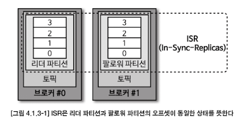
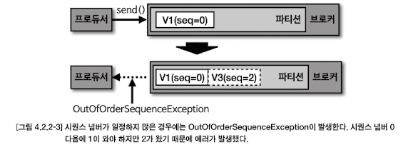

# Chapter 4. 카프카 상세 개념 설명

## 4.1. 토픽과 파티션
### 4.1.1. 적정 파티션 개수
- 토픽 생성 시 파티션 개수 고려사항
  - 데이터 처리량
  - 메시지 키 사용여부
  - 브로커, 컨슈머 영향도
- 파티션은 카프카의 `병렬처리`의 핵심이다. 파티션의 개수가 많아지면 많아질수록 1:1 매핑되는 컨슈머 개수가 늘어나기 때문이다.
- 데이터 처리 속도 올리는 방법
  - 컨슈머의 **처리량**을 늘리는 것
    - 서버의 사양을 올리는 스케일 업 or GC 튜닝 활용 가능
  - **컨슈머를 추가해서 병렬 처리량**을 늘리는 것
- 프로듀서가 보내는 데이터양, 컨슈머의 데이터 처리량을 계산해서 파티션 개수를 정하면 된다
  - 프로듀서 전송 데이터양 < 컨슈머 데이터 처리량 * 파티션 개수
  - 전체 컨슈머 데이터 처리량 < 프로듀서 전송 데이터일 경우, **컨슈머 랙이 생기고 데이터 처리 지연이 발생하게 된다**
- 컨슈머 데이터 처리량을 구하는 방법 : 상용에서 운영 중인 카프카에서 더미 데이터로 테스트를 해보는 것
- 컨슈머 데이터 처리량을 구하고 나면, 프로듀서가 보내는 데이터양을 하루,시간,분 단위로 쪼개서 예측한다
  - 만약 데이터 지연이 절대 발생해선 안된다면, 프로듀서가 보내는 데이터의 최대치를 데이터 생성량으로 잡고 계산하면 된다
- **메시지키를 사용함과 동시에 데이터 처리 순서를 지켜야 하는 경우**에 대해 고려해야 한다
  - 기본 파티셔너 사용 시, 메시지 키를 사용하면 프로듀서가 토픽으로 데이터를 보낼 때, 메시지 키를 해시 변환하여 파티션에 매칭시킨다
  - 그러므로 파티션 개수가 달라지는 순간, 메시지 키를 사용하는 컨슈머는 특정 메시지 키의 순서를 더는 보장받지 못한다
  - **메시지 키를 사용하고 컨슈머에서 메시지 처리 순서가 보장되어야 한다면 최대한 파티션의 변화가 발생하지 않는 방향으로 운영해야 한다**
    > - Kafka는 기본적으로 "하나의 파티션 내부"에서만 메시지 순서를 보장합니다.
    > - 메시지를 보낼 때 key를 지정하면 같은 key의 메시지는 항상 같은 파티션으로 가게 되어, 그 파티션에 대해 **단일 컨슈머 스레드**가 순차적으로 메시지를 처리하면 순서 보장이 가능합니다.
    > 
    > | 조건                  | 순서 보장 여부 | 설명                                           |
    > |-------------------|----------------|------------------------------------------------|
    > | 하나의 파티션 → 하나의 컨슈머 → 단일 스레드 처리 | ✅ 보장됨        | Kafka의 파티션 순서 + 순차 처리로 순서 유지     |
    > | 하나의 파티션 → 하나의 컨슈머 → 멀티스레드 처리 | ❌ 깨질 수 있음   | 메시지를 병렬 처리하는 순간, 순서가 뒤섞일 수 있음 |
  - 파티션 개수가 변해야 하는 경우에는 **기존에 사용하던 메시지 키의 매칭을 그대로 가져가기 위해 커스텀 파티셔너를 개발하고 적용**해야 한다
  - 메시지 키별로 처리 순서를 보장하려면, 파티션 개수를 프로듀서가 전송하는 데이터양보다 더 넉넉하게 잡고 생성하는 것이 좋다
- 카프카에서 파티션은 각 브로커의 `파일시스템`을 이용하므로, 파티션이 늘어나는 만큼 브로커에서 접근하는 파일 개수가 많아진다. 
  - 하지만 운영체제에서는 프로세스당 열 수 있는 파일 최대 개수를 제한하고 있다.
  - 만약, 브로커가 관리하는 파티션 개수가 너무 많을 경우, 파티션 개수를 분산하기 위해 카프카 브로커 개수를 늘리는 방안도 같이 고려해야 한다

### 4.1.2. 토픽 정리 정책 (cleanup.policy)
- 데이터를 더이상 사용하지 않을 경우 cleanup.policy 옵션으로 삭제할 수 있다
  - delete (완전 삭제) - 데이터 완전 삭제
  - compare (압축) - 동일 메시지 키의 가장 오래된 데이터를 삭제

#### 토픽 삭제 정책 (delete policy)
- 토픽의 데이터 삭제 시 `세그먼트` 단위로 삭제를 진행한다
  - 세그먼트 : 토픽의 데이터를 저장하는 **명시적인 파일 시스템 단위**

- 세그먼트는 파티션마다 별개로 생성되며 세그먼트의 파일 이름은 오프셋 중 가장 작은 값이 된다
- 세그먼트는 여러 조각으로 나뉘는데 segment.bytes 옵션으로 1개의 세그먼트 크기를 설정할 수 있다
- segment.bytes 크기보다 커질 경우에는 **기존에 적재하던 세그먼트 파일을 닫고 새로운 세그먼트를 열어서 데이터를 저장한다.**
- 액티브 세그먼트 : 데이터를 저장하기 위해 사용 중인 세그먼트
- 삭제 정책이 실행되는 시점 : 시간 or 용량
  - `retention.ms` : 토픽의 데이터를 유지하는 기간을 밀리초(millisecond)로 설정할 수 있다
    - 카프카는 일정 주기마다 세그먼트 파일의 마지막 수정 시간과 retention.ms를 비교하는데, 세그먼트 파일의 마지막 수정 시간이 retention.ms를 넘어가면 세그먼트는 삭제된다
  - `retention.bytes` : 토픽의 최대 데이터 크기 제어한다
    - retention.bytes 를 넘어간 세그먼트 파일들은 삭제된다
  
#### 토픽 압축 정책 (compact policy)
- 압축 : 메시지 키별로 해당 **메시지 키의 레코드 중 오래된 데이터를 삭제하는 정책**
  - 압축 정책은 액티브 세그먼트를 제외한 나머지 세그먼트들에 한함!
  - 
- `테일 영역 (클린 로그)` : 압축이 완료됐기에 중복된 메시지 키가 없다
- `헤드 영역 (더티 로그)` : 압축 되기 전 레코드가 존재하므로 중복된 메시지를 가진 레코드들이 있다
- 토픽의 압축은 `min.cleanable.dirty.ratio` 값에 따라 수행된다.
  - ex. 0.5 로 설정할 경우 더티 비율 (더티 레코드 개수 / (클린 + 더티 레코드 개수)) 이 0.5 가 넘어가면 압축이 수행됨
  - 0.9 와 같이 크게 비율 설정 시, **한번 압축 시 많은 데이터가 줄어드므로 압축 효과가 좋다.**   하지만 0.9 비율이 될 때까지 용량을 차지하므로 용량 효율이 좋지 않다
  - 0.1 과 같이 작게 비율 설정 시, 압축이 자주 일어나므로 **메시지 키의 최신 데이터만 유지할 수 있지만 자주 압축이 발생하는 만큼 브로커에 부담을 줄 수 있다**

### 4.1.3. ISR (In-Sync-Replicas)
- **ISR** : 리더 파티션과 팔로워 파티션이 모두 싱크가 된 상태
  - 동기화 완료 == 리더 파티션의 모든 데이터가 팔로워 파티션에 복제된 상태
  - 
- ISR 용어가 등장한 배경은, 팔로워 파티션이 리더 파티션으로부터 데이터 복제하는데에는 시간이 걸리기 때문이다
  - 프로듀서가 특정 파티션에 데이터를 저장하는 작업은 리더 파티션을 통해 처리한다
- **리더 파티션에 데이터가 적재된 이후 팔로워 파티션이 복제하는 시간차 때문에 리더 파티션과 팔로워 파티션 간에 오프셋 차이가 발생**
  - 이 차이를 모니터링하기 위해, 리더 파티션은 `replica.lag.time.max.ms` 값만큼의 주기를 갖고 팔로워 파티션이 데이터를 복제하는지 확인
  - 팔로워 파티션이 위 옵션값보다 **더 긴 시간동안 데이터를 가져가지 않을 경우, 팔로워 파티션에 문제가 생긴 것으로 판단하고 ISR 그룹에서 제외**
- ISR로 묶인 리더 파티션과 팔로워 파티션은 파티션에 존재하는 데이터가 모두 동일하기 때문에 팔로워 파티션은 리더 파티션으로 새로 선출될 자격을 가진다
  - 일부 데이터 유실이 발생하더라도, 서비스 중단 없이 지속적으로 토픽을 사용하고 싶다면 ISR 이 아닌 팔로워 파티션을 리더로 선출하도록 설정도 가능하다
    - `unclean.leader.election.enable` : ISR이 아닌 팔로워 파티션을 리더 파티션으로 선출 가능한지 여부를 선택을 위한 옵션
      - true : 리더 파티션이 존재하는 브로커에서 장애가 발생하고 동기화되지 않은 팔로워 파티션이 리더로 선출되면 **리더 파티션으로부터 동기화가 되지 않은 일부 데이터는 유실될 수 있다. 일부 데이터가 유실되는 대신 토픽을 사용하는 서비스의 중단은 발생하지 않는다**
      - false : 리더 파티션이 존재하는 브로커가 다시 시작되기까지 기다린다. **리더 파티션이 존재하는 브로커가 다시 시작될 때까지 기다리는 것은 토픽을 사용하는 서비스가 중단됨**을 뜻한다. 장애가 발생한 브로커가 다시 실행될 때까지 해당 토픽은 사용할 수 없다
- 데이터가 유실되더라도 토픽과 연동 중인 서비스의 무중단 운영이 더 중요하다면 true로 설정하면 되고, 반면, 데이터가 유실되면 안 되는 경우에는 false로 설정 해야 한다.

## 4.2. 카프카 프로듀서
### 4.2.1. acks 옵션
- 이 옵션을 통해 **프로듀서가 전송한 데이터가 카프카 클러스터에 얼마나 신뢰성 높게 저장할지 지정**할 수 있다
  - acks옵션에 따라 성능이 달라질 수 있으므로 acks 옵션에 따른 카프카의 동작 방식을 상세히 알고 설정해야 한다

#### acks=0
- acks를 0으로 설정하는 것 : 프로듀서가 리더 파티션으로 데이터를 전송했을 때 **리더 파티션으로 데이터가 저장되었는지 확인하지 않는다**
- 리더 파티션은 데이터가 저장된 이후에 데이터가 몇 번째 오프셋에 저장되었는지 리턴하는데, acks가 0으로 설정되어 있다면 **리더 파티션에 데이터 저장된 지 여부에 대한 응답값을 받지 않는다.**
- acks가 0일 때 프로듀서는 전송을 하자마자 데이터가 저장되었음을 가정하고 다음 데이터를 전송하기 때문에 데이터 전송이 실패한 경우를 알 수 없다. 
  - 따라서 retries가 2 이상으로 설정되어 있더라도 재시도를 하지 않기 때문에 retries 옵션값은 무의미하다.
- 데이터의 전송 속도는 acks를 1 또는 all로 했을 경우보다 훨씬 빠르다.  **데이터가 일부 유실이 발생하더라도 전송 속도가 중요한 경우에는 이 옵션값을 사용하면 좋다.**

#### acks=1
- acks를 1로 설정할 경우 **프로듀서는 보낸 데이터가 리더 파티션에만 정상적으로 적재되었는지 확인한다.**
  - 만약 리더 파티션에 정상적으로 적재되지 않았다면 리더 파티션에 적재될 때까지 재시도할 수 있다
- 팔로워 파티션에는 아직 데이터가 동기화되지 않을 수 있는데, **팔로워 파티션이 데이터를 복제하기 직전에 리더 파티션이 있는 브로커에 장애가 발생하면 동기화되지 못한 일부 데이터가 유실될 가능성이 있다.**

#### acks=all 또는 acks=-1
- acks를 all 또는 -1로 설정할 경우 **프로듀서는 보낸 데이터가 리더 파티션과 팔로워 파티션에 모두 정상적으로 적재되었는지 확인한다**
  - 팔로우 파티션에 데이터가 정상 적재되었는지 기다리기 때문에 **일부 브로커에 장애가 발생하더라도 프로듀서는 안전하게 데이터를 전송하고 저장할 수 있음을 보장할 수 있다**
- all 옵션값은 모든 리더 파티션과 팔로워 파티션의 적재를 뜻하는 것은 아니고, `ISR에 포함된 파티션`들을 뜻한다
- `min.insync.replicas` = 1이라면 ISR 중 최소 1개 이상의 파티션에 데이터가 적재되었음을 확인하는 것이다.   -> **이 경우 acks를 1로 했을 때와 동일한 동작을 하는데, 왜냐하면 ISR 중 가장 처음 적재가 완료되는 파티션은 리더 파티션이기 때문이다**
- min.insync.replicas의 옵션값을 2로 설정했을 때부터 acks를 all로 설정하는 의미가 있다.
  - 실제 카프카 클러스터를 운영하면서 브로커가 동시에 2개가 중단되는 일은 극히 드물기 때문에 리더 파티션과 팔로워 파티션 중 1개에 데이터가 적재 완료되었다면 데이터는 유실되지 않는다고 볼 수 있다
- 운영하는 카프카 브로커 개수 < min.insync.replicas의 옵션값 인 경우, 프로듀서가 더는 데이터를 전송할 수 없기 때문이다
  - 최소한으로 복제되어야 하는 파티션 개수가 3인데 팔로워 파티션이 위치할 브로커의 개수가 부족하면 NotEnoughReplicasException 또는 NotEnoughReplicasAfterAppen dException이 발생
  - **토픽별 min.insync.replicas 옵션값은 브로커 개수 미만으로 설정해서 운영해야 한다**
  - 상용환경에서는 일반적으로 브로커를 3대 이상으로 묶어 클러스터를 운영하는데, 이 점을 고려하여 **프로듀서가 데이터를 가장 안정적으로 보내려면 토픽의 복제 개수는 3, min.insync.replicas를 2로 설정하고 프로듀서는 acks를 all로 설정하는 것을 추천한다.**

### 4.2.2. 멱등성 (idempotence) 프로듀서
- 멱등성 프로듀서 : 동일 데이터를 **여러 번 전송해도 카프카 클러스터에 단 한번만 저장됨**
  - 기본 프로듀서 동작 방식 : 적어도 한번 전달 (at least once delivery)
    - 프로듀서가 클러스터에 데이터를 전송하여 저장할 때, 적어도 한 번 이상 데이터 데이터 적재 가능하며 데이터가 유실되지 않음
- `enable.indempotence` : 정확히 한번 전달을 위해서는 true 로 설정하여 멱등성 프로듀서로 동작하도록 만들어야 함
  - 멱등성 프로듀서는 기본 프로듀서와 달리 데이터를 브로커로 전달 시, **프로듀서 PID(Producer unique ID)와 시퀀스 넘버(sequence number)를 함께 전달**
  - 브로커는 프로듀서의 PID와 시퀀스 넘버를 확인   -> 동일한 메시지의 적재 요청이 오더라도 단 한 번만 데이터를 적재   -> 프로듀서의 데이터는 정확히 한번 브로커에 적재됨
- 멱등성 프로듀서는 `동일한 세션에서`만 정확히 한번 전달을 보장함 !
  - 동일한 세션 == PID 의 생명 주기 (즉, 프로듀서 애플리케이션에 이슈가 있어 종료 후 재시작하면 PID 가 달라짐)
  - 동일 데이터를 보내도 PID 가 달라지면, 브로커 입장에서는 다른 프로듀서로 판단함

- 브로커에서 멱등성 프로듀서가 전송한 데이터의 PID와 시퀀스 넘버를 확인하는 과정에서, 시퀀스 넘버가 일정하지 않은 경우에는 OutOfOrderSequenceException이 발생할 수 있다
  - OutOfOrderSequenceException이 발생했을 경우에는 시퀀스 넘버의 역전현상이 발생할수 있기 때문에 **순서가 중요한 데이터를 전송하는 프로듀서는 해당 Exception이 발생했을 경우 대응하는 방안을 고려해야 한다.**