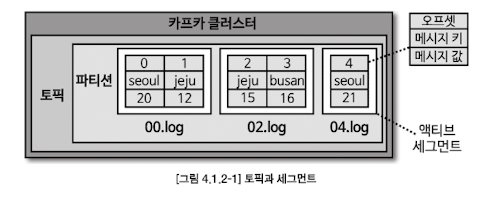
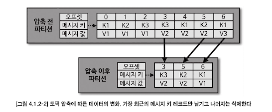

# Chapter 4. 카프카 상세 개념 설명

## 4.1. 토픽과 파티션
### 4.1.1. 적정 파티션 개수
- 토픽 생성 시 파티션 개수 고려사항
  - 데이터 처리량
  - 메시지 키 사용여부
  - 브로커, 컨슈머 영향도
- 파티션은 카프카의 `병렬처리`의 핵심이다. 파티션의 개수가 많아지면 많아질수록 1:1 매핑되는 컨슈머 개수가 늘어나기 때문이다.
- 데이터 처리 속도 올리는 방법
  - 컨슈머의 **처리량**을 늘리는 것
    - 서버의 사양을 올리는 스케일 업 or GC 튜닝 활용 가능
  - **컨슈머를 추가해서 병렬 처리량**을 늘리는 것
- 프로듀서가 보내는 데이터양, 컨슈머의 데이터 처리량을 계산해서 파티션 개수를 정하면 된다
  - 프로듀서 전송 데이터양 < 컨슈머 데이터 처리량 * 파티션 개수
  - 전체 컨슈머 데이터 처리량 < 프로듀서 전송 데이터일 경우, **컨슈머 랙이 생기고 데이터 처리 지연이 발생하게 된다**
- 컨슈머 데이터 처리량을 구하는 방법 : 상용에서 운영 중인 카프카에서 더미 데이터로 테스트를 해보는 것
- 컨슈머 데이터 처리량을 구하고 나면, 프로듀서가 보내는 데이터양을 하루,시간,분 단위로 쪼개서 예측한다
  - 만약 데이터 지연이 절대 발생해선 안된다면, 프로듀서가 보내는 데이터의 최대치를 데이터 생성량으로 잡고 계산하면 된다
- **메시지키를 사용함과 동시에 데이터 처리 순서를 지켜야 하는 경우**에 대해 고려해야 한다
  - 기본 파티셔너 사용 시, 메시지 키를 사용하면 프로듀서가 토픽으로 데이터를 보낼 때, 메시지 키를 해시 변환하여 파티션에 매칭시킨다
  - 그러므로 파티션 개수가 달라지는 순간, 메시지 키를 사용하는 컨슈머는 특정 메시지 키의 순서를 더는 보장받지 못한다
  - **메시지 키를 사용하고 컨슈머에서 메시지 처리 순서가 보장되어야 한다면 최대한 파티션의 변화가 발생하지 않는 방향으로 운영해야 한다**
    > - Kafka는 기본적으로 "하나의 파티션 내부"에서만 메시지 순서를 보장합니다.
    > - 메시지를 보낼 때 key를 지정하면 같은 key의 메시지는 항상 같은 파티션으로 가게 되어, 그 파티션에 대해 **단일 컨슈머 스레드**가 순차적으로 메시지를 처리하면 순서 보장이 가능합니다.
    > 
    > | 조건                  | 순서 보장 여부 | 설명                                           |
    > |-------------------|----------------|------------------------------------------------|
    > | 하나의 파티션 → 하나의 컨슈머 → 단일 스레드 처리 | ✅ 보장됨        | Kafka의 파티션 순서 + 순차 처리로 순서 유지     |
    > | 하나의 파티션 → 하나의 컨슈머 → 멀티스레드 처리 | ❌ 깨질 수 있음   | 메시지를 병렬 처리하는 순간, 순서가 뒤섞일 수 있음 |
  - 파티션 개수가 변해야 하는 경우에는 **기존에 사용하던 메시지 키의 매칭을 그대로 가져가기 위해 커스텀 파티셔너를 개발하고 적용**해야 한다
  - 메시지 키별로 처리 순서를 보장하려면, 파티션 개수를 프로듀서가 전송하는 데이터양보다 더 넉넉하게 잡고 생성하는 것이 좋다
- 카프카에서 파티션은 각 브로커의 `파일시스템`을 이용하므로, 파티션이 늘어나는 만큼 브로커에서 접근하는 파일 개수가 많아진다. 
  - 하지만 운영체제에서는 프로세스당 열 수 있는 파일 최대 개수를 제한하고 있다.
  - 만약, 브로커가 관리하는 파티션 개수가 너무 많을 경우, 파티션 개수를 분산하기 위해 카프카 브로커 개수를 늘리는 방안도 같이 고려해야 한다

### 4.1.2. 토픽 정리 정책 (cleanup.policy)
- 데이터를 더이상 사용하지 않을 경우 cleanup.policy 옵션으로 삭제할 수 있다
  - delete (완전 삭제) - 데이터 완전 삭제
  - compare (압축) - 동일 메시지 키의 가장 오래된 데이터를 삭제

#### 토픽 삭제 정책 (delete policy)
- 토픽의 데이터 삭제 시 `세그먼트` 단위로 삭제를 진행한다
  - 세그먼트 : 토픽의 데이터를 저장하는 **명시적인 파일 시스템 단위**

- 세그먼트는 파티션마다 별개로 생성되며 세그먼트의 파일 이름은 오프셋 중 가장 작은 값이 된다
- 세그먼트는 여러 조각으로 나뉘는데 segment.bytes 옵션으로 1개의 세그먼트 크기를 설정할 수 있다
- segment.bytes 크기보다 커질 경우에는 **기존에 적재하던 세그먼트 파일을 닫고 새로운 세그먼트를 열어서 데이터를 저장한다.**
- 액티브 세그먼트 : 데이터를 저장하기 위해 사용 중인 세그먼트
- 삭제 정책이 실행되는 시점 : 시간 or 용량
  - `retention.ms` : 토픽의 데이터를 유지하는 기간을 밀리초(millisecond)로 설정할 수 있다
    - 카프카는 일정 주기마다 세그먼트 파일의 마지막 수정 시간과 retention.ms를 비교하는데, 세그먼트 파일의 마지막 수정 시간이 retention.ms를 넘어가면 세그먼트는 삭제된다
  - `retention.bytes` : 토픽의 최대 데이터 크기 제어한다
    - retention.bytes 를 넘어간 세그먼트 파일들은 삭제된다
  
#### 토픽 압축 정책 (compact policy)
- 압축 : 메시지 키별로 해당 **메시지 키의 레코드 중 오래된 데이터를 삭제하는 정책**
  - 압축 정책은 액티브 세그먼트를 제외한 나머지 세그먼트들에 한함!
  - 
- `테일 영역 (클린 로그)` : 압축이 완료됐기에 중복된 메시지 키가 없다
- `헤드 영역 (더티 로그)` : 압축 되기 전 레코드가 존재하므로 중복된 메시지를 가진 레코드들이 있다
