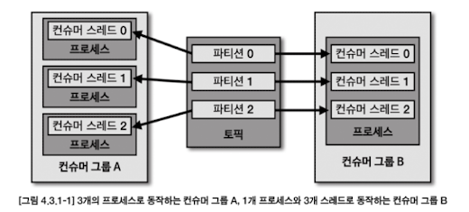
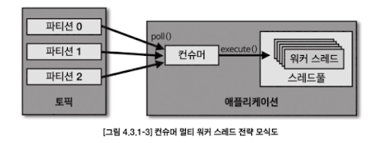
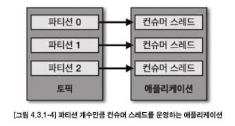

'# Chapter 4. 카프카 상세 개념 설명

## 4.1. 토픽과 파티션
### 4.1.1. 적정 파티션 개수
- 토픽 생성 시 파티션 개수 고려사항
  - 데이터 처리량
  - 메시지 키 사용여부
  - 브로커, 컨슈머 영향도
- 파티션은 카프카의 `병렬처리`의 핵심이다. 파티션의 개수가 많아지면 많아질수록 1:1 매핑되는 컨슈머 개수가 늘어나기 때문이다.
- 데이터 처리 속도 올리는 방법
  - 컨슈머의 **처리량**을 늘리는 것
    - 서버의 사양을 올리는 스케일 업 or GC 튜닝 활용 가능
  - **컨슈머를 추가해서 병렬 처리량**을 늘리는 것
- 프로듀서가 보내는 데이터양, 컨슈머의 데이터 처리량을 계산해서 파티션 개수를 정하면 된다
  - 프로듀서 전송 데이터양 < 컨슈머 데이터 처리량 * 파티션 개수
  - 전체 컨슈머 데이터 처리량 < 프로듀서 전송 데이터일 경우, **컨슈머 랙이 생기고 데이터 처리 지연이 발생하게 된다**
- 컨슈머 데이터 처리량을 구하는 방법 : 상용에서 운영 중인 카프카에서 더미 데이터로 테스트를 해보는 것
- 컨슈머 데이터 처리량을 구하고 나면, 프로듀서가 보내는 데이터양을 하루,시간,분 단위로 쪼개서 예측한다
  - 만약 데이터 지연이 절대 발생해선 안된다면, 프로듀서가 보내는 데이터의 최대치를 데이터 생성량으로 잡고 계산하면 된다
- **메시지키를 사용함과 동시에 데이터 처리 순서를 지켜야 하는 경우**에 대해 고려해야 한다
  - 기본 파티셔너 사용 시, 메시지 키를 사용하면 프로듀서가 토픽으로 데이터를 보낼 때, 메시지 키를 해시 변환하여 파티션에 매칭시킨다
  - 그러므로 파티션 개수가 달라지는 순간, 메시지 키를 사용하는 컨슈머는 특정 메시지 키의 순서를 더는 보장받지 못한다
  - **메시지 키를 사용하고 컨슈머에서 메시지 처리 순서가 보장되어야 한다면 최대한 파티션의 변화가 발생하지 않는 방향으로 운영해야 한다**
    > - Kafka는 기본적으로 "하나의 파티션 내부"에서만 메시지 순서를 보장합니다.
    > - 메시지를 보낼 때 key를 지정하면 같은 key의 메시지는 항상 같은 파티션으로 가게 되어, 그 파티션에 대해 **단일 컨슈머 스레드**가 순차적으로 메시지를 처리하면 순서 보장이 가능합니다.
    > 
    > | 조건                  | 순서 보장 여부 | 설명                                           |
    > |-------------------|----------------|------------------------------------------------|
    > | 하나의 파티션 → 하나의 컨슈머 → 단일 스레드 처리 | ✅ 보장됨        | Kafka의 파티션 순서 + 순차 처리로 순서 유지     |
    > | 하나의 파티션 → 하나의 컨슈머 → 멀티스레드 처리 | ❌ 깨질 수 있음   | 메시지를 병렬 처리하는 순간, 순서가 뒤섞일 수 있음 |
  - 파티션 개수가 변해야 하는 경우에는 **기존에 사용하던 메시지 키의 매칭을 그대로 가져가기 위해 커스텀 파티셔너를 개발하고 적용**해야 한다
  - 메시지 키별로 처리 순서를 보장하려면, 파티션 개수를 프로듀서가 전송하는 데이터양보다 더 넉넉하게 잡고 생성하는 것이 좋다
- 카프카에서 파티션은 각 브로커의 `파일시스템`을 이용하므로, 파티션이 늘어나는 만큼 브로커에서 접근하는 파일 개수가 많아진다. 
  - 하지만 운영체제에서는 프로세스당 열 수 있는 파일 최대 개수를 제한하고 있다.
  - 만약, 브로커가 관리하는 파티션 개수가 너무 많을 경우, 파티션 개수를 분산하기 위해 카프카 브로커 개수를 늘리는 방안도 같이 고려해야 한다

### 4.1.2. 토픽 정리 정책 (cleanup.policy)
- 데이터를 더이상 사용하지 않을 경우 cleanup.policy 옵션으로 삭제할 수 있다
  - delete (완전 삭제) - 데이터 완전 삭제
  - compare (압축) - 동일 메시지 키의 가장 오래된 데이터를 삭제

#### 토픽 삭제 정책 (delete policy)
- 토픽의 데이터 삭제 시 `세그먼트` 단위로 삭제를 진행한다
  - 세그먼트 : 토픽의 데이터를 저장하는 **명시적인 파일 시스템 단위**


- 세그먼트는 파티션마다 별개로 생성되며 세그먼트의 파일 이름은 오프셋 중 가장 작은 값이 된다
- 세그먼트는 여러 조각으로 나뉘는데 segment.bytes 옵션으로 1개의 세그먼트 크기를 설정할 수 있다
- segment.bytes 크기보다 커질 경우에는 **기존에 적재하던 세그먼트 파일을 닫고 새로운 세그먼트를 열어서 데이터를 저장한다.**
- 액티브 세그먼트 : 데이터를 저장하기 위해 사용 중인 세그먼트
- 삭제 정책이 실행되는 시점 : 시간 or 용량
  - `retention.ms` : 토픽의 데이터를 유지하는 기간을 밀리초(millisecond)로 설정할 수 있다
    - 카프카는 일정 주기마다 세그먼트 파일의 마지막 수정 시간과 retention.ms를 비교하는데, 세그먼트 파일의 마지막 수정 시간이 retention.ms를 넘어가면 세그먼트는 삭제된다
  - `retention.bytes` : 토픽의 최대 데이터 크기 제어한다
    - retention.bytes 를 넘어간 세그먼트 파일들은 삭제된다
  
#### 토픽 압축 정책 (compact policy)
- 압축 : 메시지 키별로 해당 **메시지 키의 레코드 중 오래된 데이터를 삭제하는 정책**
  - 압축 정책은 액티브 세그먼트를 제외한 나머지 세그먼트들에 한함!
  - 
- `테일 영역 (클린 로그)` : 압축이 완료됐기에 중복된 메시지 키가 없다
- `헤드 영역 (더티 로그)` : 압축 되기 전 레코드가 존재하므로 중복된 메시지를 가진 레코드들이 있다
- 토픽의 압축은 `min.cleanable.dirty.ratio` 값에 따라 수행된다.
  - ex. 0.5 로 설정할 경우 더티 비율 (더티 레코드 개수 / (클린 + 더티 레코드 개수)) 이 0.5 가 넘어가면 압축이 수행됨
  - 0.9 와 같이 크게 비율 설정 시, **한번 압축 시 많은 데이터가 줄어드므로 압축 효과가 좋다.** <br> 하지만 0.9 비율이 될 때까지 용량을 차지하므로 용량 효율이 좋지 않다
  - 0.1 과 같이 작게 비율 설정 시, 압축이 자주 일어나므로 **메시지 키의 최신 데이터만 유지할 수 있지만 자주 압축이 발생하는 만큼 브로커에 부담을 줄 수 있다**

### 4.1.3. ISR (In-Sync-Replicas)
- **ISR** : 리더 파티션과 팔로워 파티션이 모두 싱크가 된 상태
  - 동기화 완료 == 리더 파티션의 모든 데이터가 팔로워 파티션에 복제된 상태
  - 
- ISR 용어가 등장한 배경은, 팔로워 파티션이 리더 파티션으로부터 데이터 복제하는데에는 시간이 걸리기 때문이다
  - 프로듀서가 특정 파티션에 데이터를 저장하는 작업은 리더 파티션을 통해 처리한다
- **리더 파티션에 데이터가 적재된 이후 팔로워 파티션이 복제하는 시간차 때문에 리더 파티션과 팔로워 파티션 간에 오프셋 차이가 발생**
  - 이 차이를 모니터링하기 위해, 리더 파티션은 `replica.lag.time.max.ms` 값만큼의 주기를 갖고 팔로워 파티션이 데이터를 복제하는지 확인
  - 팔로워 파티션이 위 옵션값보다 **더 긴 시간동안 데이터를 가져가지 않을 경우, 팔로워 파티션에 문제가 생긴 것으로 판단하고 ISR 그룹에서 제외**
- ISR로 묶인 리더 파티션과 팔로워 파티션은 파티션에 존재하는 데이터가 모두 동일하기 때문에 팔로워 파티션은 리더 파티션으로 새로 선출될 자격을 가진다
  - 일부 데이터 유실이 발생하더라도, 서비스 중단 없이 지속적으로 토픽을 사용하고 싶다면 ISR 이 아닌 팔로워 파티션을 리더로 선출하도록 설정도 가능하다
    - `unclean.leader.election.enable` : ISR이 아닌 팔로워 파티션을 리더 파티션으로 선출 가능한지 여부를 선택을 위한 옵션
      - true : 리더 파티션이 존재하는 브로커에서 장애가 발생하고 동기화되지 않은 팔로워 파티션이 리더로 선출되면 **리더 파티션으로부터 동기화가 되지 않은 일부 데이터는 유실될 수 있다. 일부 데이터가 유실되는 대신 토픽을 사용하는 서비스의 중단은 발생하지 않는다**
      - false : 리더 파티션이 존재하는 브로커가 다시 시작되기까지 기다린다. **리더 파티션이 존재하는 브로커가 다시 시작될 때까지 기다리는 것은 토픽을 사용하는 서비스가 중단됨**을 뜻한다. 장애가 발생한 브로커가 다시 실행될 때까지 해당 토픽은 사용할 수 없다
- 데이터가 유실되더라도 토픽과 연동 중인 서비스의 무중단 운영이 더 중요하다면 true로 설정하면 되고, 반면, 데이터가 유실되면 안 되는 경우에는 false로 설정 해야 한다.

## 4.2. 카프카 프로듀서
### 4.2.1. acks 옵션
- 이 옵션을 통해 **프로듀서가 전송한 데이터가 카프카 클러스터에 얼마나 신뢰성 높게 저장할지 지정**할 수 있다
  - acks옵션에 따라 성능이 달라질 수 있으므로 acks 옵션에 따른 카프카의 동작 방식을 상세히 알고 설정해야 한다

#### acks=0
- acks를 0으로 설정하는 것 : 프로듀서가 리더 파티션으로 데이터를 전송했을 때 **리더 파티션으로 데이터가 저장되었는지 확인하지 않는다**
- 리더 파티션은 데이터가 저장된 이후에 데이터가 몇 번째 오프셋에 저장되었는지 리턴하는데, acks가 0으로 설정되어 있다면 **리더 파티션에 데이터 저장된 지 여부에 대한 응답값을 받지 않는다.**
- acks가 0일 때 프로듀서는 전송을 하자마자 데이터가 저장되었음을 가정하고 다음 데이터를 전송하기 때문에 데이터 전송이 실패한 경우를 알 수 없다. 
  - 따라서 retries가 2 이상으로 설정되어 있더라도 재시도를 하지 않기 때문에 retries 옵션값은 무의미하다.
- 데이터의 전송 속도는 acks를 1 또는 all로 했을 경우보다 훨씬 빠르다. <br>**데이터가 일부 유실이 발생하더라도 전송 속도가 중요한 경우에는 이 옵션값을 사용하면 좋다.**

#### acks=1
- acks를 1로 설정할 경우 **프로듀서는 보낸 데이터가 리더 파티션에만 정상적으로 적재되었는지 확인한다.**
  - 만약 리더 파티션에 정상적으로 적재되지 않았다면 리더 파티션에 적재될 때까지 재시도할 수 있다
- 팔로워 파티션에는 아직 데이터가 동기화되지 않을 수 있는데, **팔로워 파티션이 데이터를 복제하기 직전에 리더 파티션이 있는 브로커에 장애가 발생하면 동기화되지 못한 일부 데이터가 유실될 가능성이 있다.**

#### acks=all 또는 acks=-1
- acks를 all 또는 -1로 설정할 경우 **프로듀서는 보낸 데이터가 리더 파티션과 팔로워 파티션에 모두 정상적으로 적재되었는지 확인한다**
  - 팔로우 파티션에 데이터가 정상 적재되었는지 기다리기 때문에 **일부 브로커에 장애가 발생하더라도 프로듀서는 안전하게 데이터를 전송하고 저장할 수 있음을 보장할 수 있다**
- all 옵션값은 모든 리더 파티션과 팔로워 파티션의 적재를 뜻하는 것은 아니고, `ISR에 포함된 파티션`들을 뜻한다
- `min.insync.replicas` = 1이라면 ISR 중 최소 1개 이상의 파티션에 데이터가 적재되었음을 확인하는 것이다. <br> -> **이 경우 acks를 1로 했을 때와 동일한 동작을 하는데, 왜냐하면 ISR 중 가장 처음 적재가 완료되는 파티션은 리더 파티션이기 때문이다**
- min.insync.replicas의 옵션값을 2로 설정했을 때부터 acks를 all로 설정하는 의미가 있다.
  - 실제 카프카 클러스터를 운영하면서 브로커가 동시에 2개가 중단되는 일은 극히 드물기 때문에 리더 파티션과 팔로워 파티션 중 1개에 데이터가 적재 완료되었다면 데이터는 유실되지 않는다고 볼 수 있다
- 운영하는 카프카 브로커 개수 < min.insync.replicas의 옵션값 인 경우, 프로듀서가 더는 데이터를 전송할 수 없기 때문이다
  - 최소한으로 복제되어야 하는 파티션 개수가 3인데 팔로워 파티션이 위치할 브로커의 개수가 부족하면 NotEnoughReplicasException 또는 NotEnoughReplicasAfterAppen dException이 발생
  - **토픽별 min.insync.replicas 옵션값은 브로커 개수 미만으로 설정해서 운영해야 한다**
  - 상용환경에서는 일반적으로 브로커를 3대 이상으로 묶어 클러스터를 운영하는데, 이 점을 고려하여 **프로듀서가 데이터를 가장 안정적으로 보내려면 토픽의 복제 개수는 3, min.insync.replicas를 2로 설정하고 프로듀서는 acks를 all로 설정하는 것을 추천한다.**

### 4.2.2. 멱등성 (idempotence) 프로듀서
- 멱등성 프로듀서 : 동일 데이터를 **여러 번 전송해도 카프카 클러스터에 단 한번만 저장됨**
  - 기본 프로듀서 동작 방식 : 적어도 한번 전달 (at least once delivery)
    - 프로듀서가 클러스터에 데이터를 전송하여 저장할 때, 적어도 한 번 이상 데이터 데이터 적재 가능하며 데이터가 유실되지 않음
- `enable.indempotence` : 정확히 한번 전달을 위해서는 true 로 설정하여 멱등성 프로듀서로 동작하도록 만들어야 함
  - 멱등성 프로듀서는 기본 프로듀서와 달리 데이터를 브로커로 전달 시, **프로듀서 PID(Producer unique ID)와 시퀀스 넘버(sequence number)를 함께 전달**
  - 브로커는 프로듀서의 PID와 시퀀스 넘버를 확인 <br> -> 동일한 메시지의 적재 요청이 오더라도 단 한 번만 데이터를 적재 <br> -> 프로듀서의 데이터는 정확히 한번 브로커에 적재됨
- 멱등성 프로듀서는 `동일한 세션에서`만 정확히 한번 전달을 보장함 !
  - 동일한 세션 == PID 의 생명 주기 (즉, 프로듀서 애플리케이션에 이슈가 있어 종료 후 재시작하면 PID 가 달라짐)
  - 동일 데이터를 보내도 PID 가 달라지면, 브로커 입장에서는 다른 프로듀서로 판단함


- 브로커에서 멱등성 프로듀서가 전송한 데이터의 PID와 시퀀스 넘버를 확인하는 과정에서, 시퀀스 넘버가 일정하지 않은 경우에는 OutOfOrderSequenceException이 발생할 수 있다
  > 시퀀스 넘버가 일정하지 않게 되는 예시 상황
  > - 1. 프로듀서가 갑자기 종료되고 다시 시작 → 새로운 PID 할당 → 이전 세션의 시퀀스 번호보다 낮은 번호로 메시지를 보냄 → 브로커 입장에서는 "역전"이라고 판단
  >   - [이전 프로듀서 세션] <br>PID=123, SeqNum=0, 1, 2, 3
  >   - [새로운 프로듀서 세션] <br>PID=456, SeqNum=0 ← 브로커는 PID가 바뀌었으니 새 시퀀스로 인식 → OK
  > - 2. 하나의 KafkaProducer 인스턴스를 여러 스레드에서 공유하거나, 복제된 인스턴스가 동일한 PID를 가지면, 서로 다른 쓰레드나 인스턴스가 동일 파티션에 중복된/꼬인 시퀀스를 전송할 수 있음
  - OutOfOrderSequenceException이 발생했을 경우에는 시퀀스 넘버의 역전현상이 발생할수 있기 때문에 **순서가 중요한 데이터를 전송하는 프로듀서는 해당 Exception이 발생했을 경우 대응하는 방안을 고려해야 한다.**

### 4.2.3. 트랜잭션 (transaction) 프로듀서
- 트랜잭션 프로듀서는 **다수의 파티션에 데이터를 저장할 경우 모든 데이터에 대해 동일한 원자성(atomic)을 만족시키기 위해 사용**된다
  - 원자성 만족시킨다 == 다수 데이터를 동일 트랜잭션으로 묶어서 전체 데이터 처리하거나, 처리하지 않도록 하는 것 (all or nothing)
- enable.idempotence : true
- transactional.id 를 임의의 String값으로 정의
- 컨슈머의 isolation.level을 read_committed 로 설정 <br>
→ 프로듀서와 컨슈머는 트랜잭션으로 처리 완료된 데이터만 쓰고 읽게 된다


- 트랜잭션 프로듀서는 사용자가 보낸 데이터를 레코드로 파티션에 저장 + **트랜잭션의 시작과 끝을 표현하기 위해 트랜잭션 레코드를 1개 더 보낸다.** 
  - 트랜잭션 컨슈머는 파티션에 저장된 **트랜잭션 레코드를 보고 트랜잭션이 완료(commit)되었음을 확인**하고 데이터를 가져간다.
  - 트랜잭션 레코드는 실질적 데이터 X, 트랜잭션이 끝난 상태를 표시하는 정보만 가짐
  - 트랜잭션 컨슈머는 **커밋이 완료된 데이터가 파티션에 있을 경우에만 데이터를 가져간다.**
    - 만약 데이터만 존재하고 트랜잭션 레코드가 존재하지 않으면 아직 트랜잭션이 완료되지 않았다고 판단하고 데이터를 가져가지 않는다.
> ✅ 트랜잭션 프로듀서 실사례
> 1. DB → Kafka 싱크 연동 (CDC, ETL 등)
>    - DB 커밋됐을 때만 Kafka에도 메시지를 전송하고 싶다.
> 2. 여러 토픽에 전송할 때 원자성 보장
>    - **두 개 이상의 토픽에 동시에 메시지를 보내되, 일부만 성공해서는 안 된다.**

## 4.3. 카프카 컨슈머
### 4.3.1. 멀티 스레드 컨슈머
- 파티션 개수가 N개라면, 동일 컨슈머 그룹으로 묶인 컨슈머 스레드를 최대 N개 운영할 수 있다
  - N개의 스레드를 가진 1개 프로세스 운영 or 1개의 스레드를 가진 프로세스 N개 운영
  - 
  > ❓ **컨슈머 그룹으로 묶지 않고 컨슈머 스레드 여러 개로 운영하면 안되는가?**
  > - 컨슈머 그룹 없이 개별 컨슈머만 돌리면...
  >    - 각 컨슈머가 같은 데이터를 중복 소비하거나
  >    - Kafka가 파티션을 자동으로 할당해주지 않음 (카프카는 **컨슈머 그룹 단위로 파티션 분배**)
  >    - 처리 순서가 꼬일 수 있음
  >    - 수평 확장이나 장애 복구가 불가능
  > - 왜 컨슈머 그룹으로 운영하나?
  >    - **하나의 파티션은 하나의 컨슈머 그룹 안에서 오직 하나의 컨슈머만 읽을 수 있기 때문에, 메시지 중복 없이 병렬 처리하기 위함**
  > - 그룹이 다르면?
  >    - 같은 메시지를 각기 다르게 소비 가능 (멀티 파이프라인)
  > - 스레드만 여러 개 쓰면?	
  >    - 파티션 충돌, 중복 소비, 리밸런싱 불가 등 문제 발생
  > - 결국 "컨슈머 그룹 없이 병렬 처리" = Kafka 설계 철학에 맞지 않는 비권장 패턴
- 멀티 스레드로 컨슈머를 안전하게 운영하기 위해서는 고려할 부분이 많은데, 하나의 컨슈머 스레드에서 예외 상황 (OOM) 발생 시 프로세스 자체가 종료될 수도 있고, 이는 다른 컨슈머 스레드에까지 영향을 미칠 수 있다
  - 따라서 **각 컨슈머 스레드 간에 영향을 미치지 않도록 스레드 세이프 로직, 변수를 적용해야 한다**
- 컨슈머를 멀티 스레드로 활용하는 방식
  1. `멀티 워커 스레드` 전략 :  **컨슈머 스레드 1개 실행 / 데이터 처리를 담당하는 워커 스레드 여러 개** 실행
  2. `컨슈머 멀티 스레드` 전략 : **컨슈머 인스턴스에서 poll() 메서드 호출하는 스레드 여러개 띄워서** 사용 

#### 카프카 컨슈머 멀티 워커 스레드 전략
- 멀티 스레드를 생성하는 ExecutorService 자바 라이브러리를 사용하면 레코드를 병렬처리하는 스레드를 효율적으로 생성하고 관리할 수 있다
  - 작업 이후 스레드가 종료되어야 한다면 CachedThreadPool을 사용하여 스레드를 실행한다
    - newCachedThreadPool 은 필요한 만큼 스레드 풀을 늘려서 스레드를 실행하는 방식으로, 짧은 시간의 생명주기를 가진 스레드에서 유용하다


```java
public class ConsumerWorker implements Runnable { 
  private String recordValue;
  
  ConsumerWorker(String recordValue) { 
    this.recordValue = recordValue;
  }

  @Override public void run() { 
    logger.info("thread:{}\trecord:{}", Thread.currentThread().getName(), recordValue);
  } 
}
```
- 데이터를 처리하는 스레드를 개별로 생성하기 위해 **데이터를 처리하는 사용자 지정 스레드를 새로 생성**
  - Runnable 인터페이스로 구현한 클래스이므로 스레드로 실행되며, 생성되고 나면 run() 메서드가 실행되어 이 메소드에서 데이터가 처리됨
```java
KafkaConsumer<String, String> consumer = new KafkaConsumer<>(configs);
consumer.subscribe(Arrays.asList(TOPIC_NAME));
ExecutorService executorService = Executors.newCachedThreadPool();

while (true) {
  ConsumerRecords<String, String> records = consumer.poll(Duration.ofSeconds(10));
  for (ConsumerRecord<String, String> record : records) {
    ConsumerWorker worker = new ConsumerWorker(record.value());
    executorService.execute(worker);
  }
}
```
- 데이터를 처리하는 ConsumerWorker 클래스로, **poll() 메서드를 통해 리턴받은 레코드들을 처리하는 스레드를 레코드마다 개별 실행한다**
- 스레드를 사용하면 한번 poll()을 통해 받은 데이터를 `병렬처리` 함으로써 속도의 이점을 확실히 얻을 수 있다. 

주의사항
1. 스레드를 사용함으로써 **데이터 처리가 끝나지 않았음에도 불구하고 커밋을 하기 때문에 리밸런싱, 컨슈머 장애 시에 데이터 유실이 발생할 수 있다**
    - 위 코드는 각 레코드의 데이터 처리가 끝났음을 스레드로부터 리턴받지 않고 바로 그 다음 poll() 메서드를 호출한다
    - **오토 커밋일 경우 데이터 처리가 스레드에서 진행 중임에도 불구하고 다음 poll() 메서드 호출 시에 커밋을 할수 있기 때문에 발생하는 현상**이다. 
    > ➕ enable.auto.commit = true 일 경우에는 설정된 주기에 따라 KafkaConsumer가 백그라운드 스레드로 커밋을 함. <br> 
    > 1. 메시지를 poll()로 가져온 후,
    > 2. 각 레코드를 별도 스레드로 비동기 처리하고,
    > 3. KafkaConsumer는 그 다음 poll()을 호출
    > 4. 이 과정에서 자동 커밋이 동작하면, 아직 처리 중인 메시지도 커밋된 것으로 간주됨
    > - 스레드에서 예외가 발생하거나 처리 도중 종료되면 → 해당 메시지는 처리 실패하지만 커밋되어 다시 처리되지 않음
    > - 컨슈머가 다운되거나 리밸런싱되면 → 처리 중이던 메시지가 사라짐
    > 
    > ✅ 해결 방안
    > - 수동 커밋 사용 (enable.auto.commit=false)
    > - 스레드 작업 완료를 추적할 메커니즘 필요
    >   - ex. Future, CountDownLatch, ExecutorService.invokeAll() 등을 사용해 각 레코드의 처리가 완료된 후에만 커밋하도록 설계
    > - 처리 결과를 별도 저장소에 기록하는 패턴
    >   - DB나 로그 저장소에 저장 후, 메시지는 중복 처리 허용 기반으로 설계 (idempotent)


1. **레코드 처리의 역전현상**
   - for 문으로 스레드를 생성하므로 레코드별로 스레드의 생성은 순서대로 진행되지만, 스레드의 처리 시간은 다를 수 있다. 
   - 나중에 생성된 스레드의 레코드 처리 시간이 더 짧을 경우 이전 레코드가 다음 레코드보다 나중에 처리될 수 있다. 
   - **레코드 처리에 있어 중복이 발생하거나 데이터의 역전현상이 발생해도 되며 매우 빠른 처리 속도가 필요한 데이터 처리에 적합하다.**
     - ex. 서버 리소스(CPU, 메모리 등) 모니터링 파이프라인, IoT 서비스의 센서 데이터 수집 파이프라인

#### 카프카 컨슈머 멀티 스레드 전략
- **토픽의 파티션 개수만큼 컨슈머 스레드 개수를 늘려서 운영하는 것**이다. 
  - 컨슈머 스레드를 늘려서 운영하면 각 스레드에 각 파티션이 할당되며, 파티션의 레코드들을 병렬처리 할 수 있다.



```java
public class ConsumerWorker implements Runnable {
    private final static Logger logger = LoggerFactory.getLogger(ConsumerWorker.class);
    private Properties prop;
    private String topic;
    private String threadName;
    private KafkaConsumer<String, String> consumer; 
    // kafkaConsumer 는 스레드 세이프 하지 않은 클래스이므로, 스레드별로 별개의 인스턴스를 만들어서 운영해야 한다

    ConsumerWorker(Properties prop, String topic, int number) {
        this.prop = prop;
        this.topic = topic;
        this.threadName = "consumer-thread-" + number;
    }

    @Override
    public void run() {
        consumer = new KafkaConsumer<>(prop);
        consumer.subscribe(Arrays.asList(topic));
        while (true) {
            ConsumerRecords<String, String> records = consumer.poll(Duration.ofSeconds(1));
            for (ConsumerRecord<String, String> record : records) {
                logger.info("{}", record);
            }
            consumer.commitSync();
        }
    }
}
```

```java
public static void main(String[] args) {
  Properties configs = new Properties();
  ...(설정 중략)...

  ExecutorService executorService = Executors.newCachedThreadPool();
  for (int i = 0; i < CONSUMER_COUNT; i++) {
    ConsumerWorker worker = new ConsumerWorker(configs, TOPIC_NAME, i);
    executorService.execute(worker);
  }
}
```
- 위 코드를 통해 1개의 애플리케이션에 N 개의 컨슈머 스레드를 띄울 수 있다
- 스레드 하나 당 카프카 컨슈머 1개씩을 담당하여 후처리 및 커밋 로직이 동작한다
