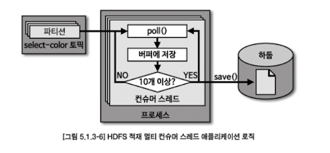
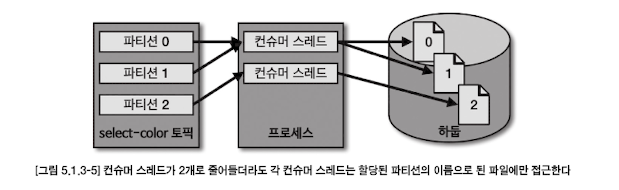
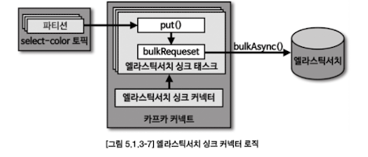
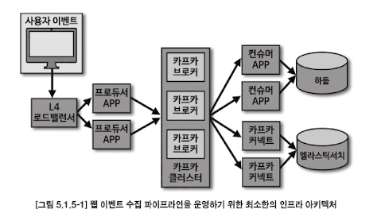
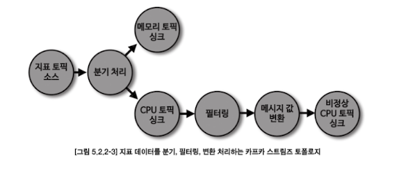

# Chapter 5. 카프카 실전 프로젝트
## 5.1. 웹 페이지 이벤트 적재 파이프라인 생성
- 카프카는 웹 이벤트 수집 파이프라인을 만들고 운영하기에 최적화되어 있다

### 5.1.1. 요구사항
- 하둡 : 대용량 데이터 분석처리
  - HDFS : 대용량 파일을 하둡에 안정적으로 저장할 수 있게 하는 파일 시스템

### 5.1.2. 정책 및 기능 정의

#### 적재 정책
- 카프카는 멱등성 프로듀서를 통해 정확히 한번 전달을 지원한다
  - 이 때 전달은, **프로듀서 ~ 브로커까지 전달**되는 것을 의미한다
- 하지만 정확히 한번 전달되더라도 정확히 한번 적재는 되지 않을 수 있는데, 컨슈머 커밋 시점과 데이터 적재가 동일 트랜잭션에서 처리되어야 정확히 한번 적재될 수 있기 때문이다
    > 문제: 컨슈머 ↔ DB 적재
    > - 컨슈머는 메시지를 읽음
    > - DB에 insert
    > - 컨슈머가 offset commit (이제 "이 메시지는 처리 완료" 표시)
    > 
    > 즉, DB 저장과 offset commit을 분리해서 하면 중복/유실이 생길 수 있으니, **두 작업을 원자적으로 묶어야만 정확히 한 번 처리(적재)가 보장**

#### 데이터포맷
- 데이터 파이프라인에서 데이터를 담는 용도로 사용되는 데이터 포맷은 매우 다양할 수 있다
  - VO (Value Object) 형태로 객체를 선언하여 직렬화하여 전송
    - 보편적이고 편리하지만 프로듀서와 컨슈머에서 동일한 버전의 VO 객체를 선언해서 사용해야 한다는 문제점이 있다 -> 스키마가 변경될 경우 (변수가 추가될 경우) 프로듀서와 컨슈머 둘 다 소스코드 업데이트가 필요하므로 비용이 크다
    - 직렬화된 객체는 kafka-console-consumer 명령어를 통해 출력할 경우 내부 데이터를 확인할 수 없기 때문에 디버깅이 어려우며, 디버깅을 위해서는 해당 객체에 특화된 역직렬화 클래스가 필요하다.
- 데이터 포맷 선택 시 우선적으로 생각해볼 수 있는 내용은 `스키마의 변화의 유연성`, 명령어를 통한 `디버깅의 편리성` 이다

#### 프로듀서
- acks를 1로 선택한 경우에는 min.insync.replicas 설정을 무시하고 리더 파티션에 지속 적재하므로 따로 설정할 필요가 없다
- 파티셔너 활용 시, 메시지 키 또는 메시지 값을 기반으로 어떤 파티션으로 전달될지 결정하는 로직을 적용할 수 있다.
- 압축 시 클러스터에 적재되는 데이터의 총 용량을 줄이고 네트워크의 사용량을 줄이는 데에 효과적이다.

#### 토픽
- 파티션 개수는 데이터 처리 순서를 지켜야 하는지 여부에 따라 엄격하게 정할지 말지 결정한다

#### 컨슈머
- 반복적으로 생성되는 파이프라인 운영이 필요할 때 확장 가능한 멀티 스레드 애플리케이션을 개발하기 위해서는 상당한 노력이 들어간다

### 5.1.3. 기능 구현

#### 하둡 적재 컨슈머 애플리케이션 개발

```java
    public static void main(String[] args) {
        Runtime.getRuntime().addShutdownHook(new ShutdownThread()); // 안전한 컨슈머의 종료를 위해 셧다운 훅 선언

        Properties configs = new Properties();
        configs.put(ConsumerConfig.BOOTSTRAP_SERVERS_CONFIG, BOOTSTRAP_SERVERS);
        configs.put(ConsumerConfig.GROUP_ID_CONFIG, GROUP_ID);
        configs.put(ConsumerConfig.KEY_DESERIALIZER_CLASS_CONFIG, StringDeserializer.class.getName());
        configs.put(ConsumerConfig.VALUE_DESERIALIZER_CLASS_CONFIG, StringDeserializer.class.getName());

        ExecutorService executorService = Executors.newCachedThreadPool(); // 컨슈머 스레드를 스레드 풀로 관리하기 위해 newCachedThreadPool()을 생성
        for (int i = 0; i < CONSUMER_COUNT; i++) {
            workers.add(new ConsumerWorker(configs, TOPIC_NAME, i)); // 생성된 컨슈머 스레드 인스턴스들을 묶음으로 관리하기 위해 List<ConsumerWorker>로 선언된 workers 변수에 추가
        }
        workers.forEach(executorService::execute); // execute() 메서드로 컨슈머 스레드 인스턴스들을 스레드 풀에 포함시켜 실행
    }

    static class ShutdownThread extends Thread {
        public void run() {
            logger.info("Shutdown hook");
            workers.forEach(ConsumerWorker::stopAndWakeup); // 셧다운 훅이 발생했을 경우 각 컨슈머 스레드에 종료를 알리도록 명시적으로 stopAndWakeup() 메서드 호출
        }
    }
```
- 어떤 방식으로 데이터를 적재하느냐는 데이터를 최종 적재하는 타깃 애플리케이션의 기능 지원 여부에 따라 달라진다.
  - append? flush?
- 컨슈머 멀티 스레드 환경은 동일 데이터의 동시 접근에 유의해야 한다. 여러 개의 컨슈머가 동일한 HDFS파일에 접근을 시도한다면 교착 상태에 빠질 수 있는 위험이 있기 때문이다
  - 따라서 컨슈머 스레드에 할당된 파티션을 확인한 후, 데이터들을 각 파티션 번호를 붙인 파일에 저장한다 (즉, 파티션 0은 0번 파일에만 접근)
  - 

```java
public class ConsumerWorker implements Runnable { // 컨슈머가 실행될 스레드를 정의하기 위해 Runnable 인터페이스로 ConsumerWorker 클래스 구현

    private final Logger logger = LoggerFactory.getLogger(ConsumerWorker.class);
    private static Map<Integer, List<String>> bufferString = new ConcurrentHashMap<>(); // 컨슈머 poll() 메서드를 통해 전달받은 데이터 임시저장하는 버퍼
    private static Map<Integer, Long> currentFileOffset = new ConcurrentHashMap<>();

    private final static int FLUSH_RECORD_COUNT = 10;
    private Properties prop;
    private String topic;
    private String threadName;
    private KafkaConsumer<String, String> consumer;

    public ConsumerWorker(Properties prop, String topic, int number) {
        logger.info("Generate ConsumerWorker");
        this.prop = prop;
        this.topic = topic;
        this.threadName = "consumer-thread-" + number;
    }
}
```
#### 엘라스틱서치 싱크 커넥터 개발

- 커넥터는 그 자체로는 실행되지 못하기 때문에 플러그인으로 추가하기 위해서는 자바 파일들을 컴파일하여 압축해야 한다

### 5.1.4. 기능 테스트
#### 분산 모드 카프카 커넥트 실행
- 싱크 커넥터를 실행하려면 커넥트에 플러그인을 추가해야 한다.
- 분산 커넥트를 실행하기 위한 3가지 단계
  - 엘라스틱서치 싱크 커넥터 jar 파일 생성, jar 파일 이동 (카프카 커넥터가 참조할 수 있는 디렉토리로 이동)
  - 분산 모드 커넥트 설정파일 수정
    - 통신할 카프카 클러스터의 부트스트랩 서버, 플러그인 파일들이 포함된 디렉토리 설정 추가
  - 분산 모드 커넥트 실행

### 5.1.5. 상용 인프라 아키텍처
- 최소한 웹 이벤트 수집 파이프라인 인프라를 구축하여 안전하게 운영하고 싶다면 아래와 같은 구성을 추천한다
  - L4 로드밸런서: 웹 이벤트를 받아서 프로듀서로 분배 역할
  - 프로듀서: 2개 이상의 서버, 각 서버당 1개 프로듀서
  - 카프카 클러스터: 3개 이상의 브로커로 구성
  - 컨슈머: 2개 이상의 서버, 각 서버당 1개 컨슈머
  - 커넥트: 2개 이상의 서버, 분산 모드 커넥트로 구성


- 파티션, 컨슈머 스레드, 커넥트 태스크 개수를 증가시키면 `병렬 처리` 되는 양을 증가시켜서 **적재 지연을 줄일 수 있다**

## 5.2. 서버 지표 수집 파이프라인 생성과 카프카 스트림즈 활용
- 카프카는 불특정 다수 서버 지표를 수집하는 데에 아주 적합하며, 카프카를 사용하면 클러스터를 스케일 아웃하거나 파티션을 늘림으로써 변화하는 데이터양에 유연하게 대응할 수 있다

### 5.2.1. 요구 사항
- 카프카 스트림즈는 운영하는 데에 별개의 클러스터가 필요하지 않고 독립된 자바 애플리케이션으로써 동작하기 때문에 배포 완료된 이후 운영하는 데에 큰 리소스가 들지 않는다

### 5.2.2. 정책 및 기능 정의
### 카프카 스트림즈
- 수집된 **서버의 지표 데이터를 분기처리하고 필터링하는 동작**은 카프카 스트림즈가 최적이다.
- 카프카 스트림즈로 개발할 때는 요구사항에 맞는 형태로 `토폴로지`(topology)를 그리고 각 프로세서에 맞는 DSL 메서드를 찾아서 적용하면 된다


## 5.3. 미러메이커2를 사용한 토픽 미러링

### 