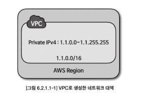
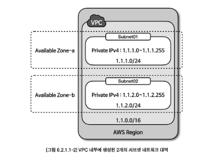
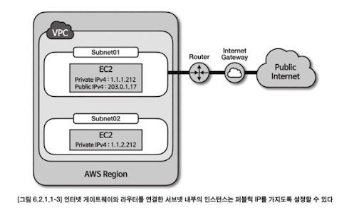

# Chapter 6. 클라우드 카프카 서비스

### 인프라 관리의 이점
- 카프카 SaaS 서비스를 사용하게 되면 **브로커가 올라가는 서버는 자동으로 관리**되므로, SaaS를 사용할 경우 인프라 운영 관련 역할에서 자유로울 수 있다
  - SaaS 서비스가 이슈를 감지하여 이슈가 생긴 서버를 제외하고 신규 장비에 브로커를 실행하여 클러스터를 복구한다

### 모니터링 대시보드 제공
- SaaS형 카프카에서는 자동화되어 만들어진 **클러스터로부터 운영에 필요한 지표들을 수집하고 그래프로 보여주는 옵션이 제공**된다. 
  - 만약 직접 카프카 클러스터를 운영했다면 수집한 지표를 저장할 저장소 구축 + 대시보드를 운영하기 위해 신규로 추가 플랫폼을 설치, 운영해야 한다

### 보안 설정 제공
- 카프카 브로커는 SSL, SASL, ACL과 같이 **불특정 다수의 침입을 막기 위해 다양한 종류의 보안 설정** 방안을 제공하고 있다.
- SaaS형 카프카에서는 클러스터 접속 시 보안 설정을 기본으로 제공하고 있으며, 클러스터 생성 시 보안 설정을 통해 인가된 사용자만 카프카 클러스터에 접근할 수 있도록 할 수 있다.

### 서비스 사용비용

### 커스터마이징의 제한
- 모든 부분이 자동화되어 있고 업체에서 설정한 아키텍처를 따라가기 때문에 상세한 설정을 적용하거나 클러스터 아키텍처의 변화가 필요할 경우 적용하기 매우 어렵다.
- 특히 **멀티 클라우드**(2개 이상의 퍼블릭 클라우드 함께 사용)나 **하이브리드 클라우드**(사내 서버와 퍼블릭 클라우드를 함께 사용) **형태로 카프카 클러스터를 구성하는 것은 SaaS형 카프카에서는 불가능하다**

### 클라우드 종속성
- 클라우드 종속성을 탈피하기 위해서는 멀티 클라우드 또는 하이브리드 클라우드를 도입하는 방법이 있다.   하지만, SaaS형 카프카를 사용할 경우에는 멀티 클라우드, 하이브리드 클라우드 적용이 불가능하다.

## 6.1. 컨플루언트 클라우드

## 6.2. AWS MSK
- 안전하게 접속할 수 있게 클러스터와 연동 시 TLS 인증 보안 설정 가능
- 기본 모니터링 데이터를 AWS Cloudwatch 로 확인할 수 있도록 제공
  - MSK 에서 제공하는 기본 모니터링 지표 외에 브로커의 각 노드, 브로커의 모니터링 지표 확인하고 싶을 때는 프로메테우스 플랫폼과 연동할 수 있는 JMX 익스포터, 노드 익스포터도 제공한다
  - JMX 익스포터를 통해 카프카 브로커의 모니터링 지표를 수집하고 노드 익스포터를 통해 브로커 인스턴스의 지표들 (CPU, 메모리, 네트워크 등)을 수집하여 운영 시 활용할 수 있다

### 6.2.1. MSK 활용
#### 6.2.1.1. 클러스터 생성
- **VPC**
  - VPC (Virtual Private Cloud) 는 **사용자가 정의한 가상의 네트워크**로, 온프레미스에서 운영하는 내부 네트워크 개념과 유사하다
  - **리전 선택하고 특정 IP 대역을 VPC 로 생성 가능**
    - VPC 로 생성한 네트워크 대역에 프라이빗 IP 를 가진 EC2 인스턴스 생성 가능
  - 
- **AZ (Available Zone)**
  - AWS 리전에 존재하는 개별 데이터 센터
  - 각 AZ는 다른 AZ와 물리적으로 구분되어 있기 때문에 AZ의 장애는 다른 AZ에 전파되지 않는다 
  - AWS의 서울 리전(ap-northeast-2)에서는 총 4개의 AZ(apnortheast-2a, ap-northeast-2b, ap-northeast-2c, ap-northeast-2d)를 제공한다.
- **서브넷 (subnet)**
  - VPC 내부에서 생성할 수 있는 네트워크 대역
  - 서브넷을 만들 때는 VPC 네트워크 대역에 포함된 네트워크 영역을 지정해야 한다.
  - 서브넷은 단일 AZ에만 존재하며 여러 AZ에 걸쳐서 AZ를 생성할 수 없다.
  - 
- **인터넷 게이트웨이 (Internet Gateway)**
  - 인터넷 게이트웨이가 설정되지 않은 서브넷은 구글, 네이버와 같은 퍼블릭 네트워크와 통신할수 없다. 
  - 따라서 서브넷의 네트워크 영역에 생성된 EC2 인스턴스가 퍼블릭 네트워크와 연결하기 위해서는 인터넷 게이트웨이를 설정해야 한다
  - 퍼블릭 서브넷에서 EC2 인스턴스를 생성하면 퍼블릭 네트워크에서 접속할 수 있도록 퍼블릭 IP가 할당된다.
- **라우팅 테이블**
  - VPC, 인터넷 게이트웨이, VPN 연결 시 서브넷 간 패킷 전달 규칙을 지정하며, VPC의 각 서브 넷은 1개 이상 라우팅 테이블과 연결된다
  - 
