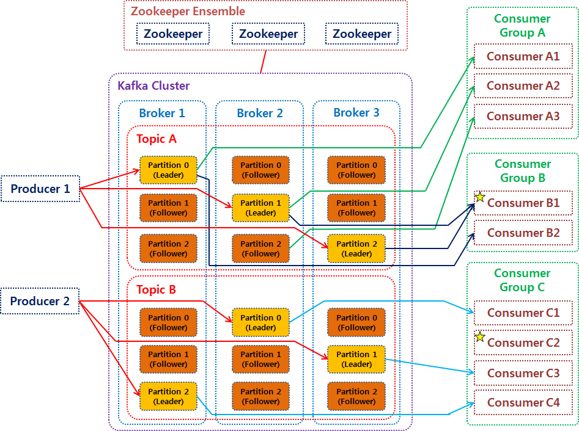

# Chapter 2. 카프카 빠르게 시작해보기

## 2.1. 실습용 카프카 브로커 설치
### 2.1.1. AWS EC2 인스턴스 발급 및 보안 설정
- 주키퍼 : 분산 코디네이션 서비스 제공하는 오픈소스
  - 분산 코디네이션 서비스 : 분산 시스템 내부에 상태정보 저장 및 데이터를 Key/value 저장소로 저장 및 제공하는 서비스
- 카프카에서는 주키퍼를 **운영에 필요한 각종 설정과 상태 저장용으로 사용하고 있음**
  - 주키퍼, 브로커 : JVM 위에서 돌아가는 애플리케이션 -> 힙 메모리 지정 필요

### 2.1.3. 인스턴스에 자바 설치
- 카프카 브로커 : 스칼라와 자바로 작성되어 JVM 환경 위에서 실행된다

### 2.1.4. 주키퍼, 카프카 브로커 실행
#### 카프카 브로커 힙 메모리 설정
- 카프카 브로커는 **레코드 내용은 페이지 캐시로 시스템 메모리를 사용하고, 나머지 객체들을 힙 메모리에 저장하여 사용한다**
- 카프카 패키지의 힙 메모리는 카프카 브로커 - 1G, 주키퍼 - 512MB 로 기본 설정되어 있다
  - 힙 메모리 커스텀 지정하고 싶다면 `KAFKA_HEAP_OPTS` 환경 변수를 힙 메모리 사이즈와 함께 지정하면 된다
- 카프카 실행하기 위해 사용하는 kafka-server-start.sh 스크립트 내부에서는 `-daemon` 옵션을 사용하여 백그라운드 / 포어 그라운드 실행 여부를 결정할 수 있다
  - -daemon 을 붙일 경우 백그라운드 실행됨 -> 이 경우 실행중인 터미널 세션이 끊겨도 카프카 브로커는 계속해서 동작함
    - 일시적 카프카 브로커 테스트가 아닌 이상, **-daemon 옵션을 붙여 백그라운드로 실행하는 게 일반적인 운영 방법**

#### 카프카 브로커 실행 옵션 설정
- advertised.listener 는 카프카 클라이언트 또는 커맨드 라인 툴을 브로커와 연결할 때 사용된다

#### 주키퍼 실행
- 주키퍼는 카프카의 클러스터 설정 리더 정보, 컨트롤러 정보를 담고 있어 카프카를 실행하는 데에 필요한 필수 애플리케이션이다

#### 카프카 브로커 실행 및 로그 확인
- 카프카 클라이언트 개발할 때뿐만 아니라, 카프카 클러스터를 운영할 때 이슈가 발생할 경우 모두 카프카 브로커에 로그가 남는다.

## 2.2. 카프카 커맨드 라인 툴
### 2.2.1. kafka-topics.sh
#### 토픽 생성
```bash
bin/kafka-topics.sh \
  --create \
  --bootstrap-server my-kafka:9092 \
  --partitions 3 \
  --replication-factor 1 \
  --config retention.ms=172800000 \
  --topic hello.kafka.2
```

- --replication-factor : 토픽의 파티션을 복제할 복제 계수 (=각 파티션을 몇 개의 브로커에 복제할 것인가) 
  - replication.factor <= 브로커 수여야 함. 
  - 1일 경우 복제하지 않고 사용 (ex. 브로커, 복제 계수 모두 1로 가정. 파티션=3)
    > - 즉, 브로커 A의 파티션의 데이터를 복제해서 가지고 있을 브로커 B의 파티션이 없음. => **브로커 A에 리더 파티션만 존재** 
    > - 브로커 A의 해당 토픽의 파티션이 총 3개였다면, 3개 모두 리더 파티션이 되는 것
  - 파티션의 데이터는 각 브로커마다 저장됨
  - 복제 계수 min = 1, max = 통신하는 카프카 클러스터의 브로커 개수
    > - 파티션의 복제 계수(replication factor)가 3인 경우 (= 복제 2개) (ex. 브로커, 복제 계수 모두 3으로 가정. 파티션=3)
    > - 복제 계수가 3이므로 브로커 A의 파티션의 데이터를 복제해서 가지고 있을 브로커 B, C의 파티션 존재 => 브로커 A의 파티션이 3개였다면 A와 B, C는 **각각 하나씩의 리더 파티션과 두개씩의 팔로워 파티션**을 가지고 있음
> - 브로커=3, 복제 계수=1, 파티션=3 인 경우
>   - 파티션 3개가 각 브로커에 하나씩 분산되고 모두 리더 (복제본 없음)

#### 토픽 상세 조회
- 여러 대의 브로커로 카프카 클러스터 운영 시, 토픽의 리더 파티션이 일부 브로커에 몰려있을 수 있다.
    > - 초기 파티션 할당 방식의 한계
    >   - Kafka는 새로운 토픽 생성 시, 설정된 num.partitions, replication.factor를 기반으로 파티션을 자동으로 분배 => 자동 분배는 균등한 리더 분산을 보장하지 않음.
    >   - 리더 파티션은 단순히 첫 번째 replica가 됨 (replica list에서 첫 번째).
    >   - 따라서 **어떤 브로커가 자주 replica list의 첫 번째로 지정되면, 해당 브로커가 과도한 리더 파티션을 담당**
- 이 경우, **부하가 분산되지 못해 데이터 통신 쏠림 현상 발생 -> 네트워크 대역 이슈 발생 가능성 있음**

- 카프카 클러스터 성능이 생각보다 좋지 않다면, 토픽 상세 조회 명령을 통해 토픽의 리더 파티션 쏠림 현상을 확인하는 것도 좋은 방법이다

### 2.2.2. kafka-console-producer.sh
- 메시지 키가 존재하는 경우에는 키의 해시 값을 작성하여 존재하는 파티션 중 하나로 할당
  - 이로 인해 **메시지 키가 동일할 경우 동일 파티션으로 전송됨**

### 2.2.3. kafka-console-consumer.sh
- 컨슈머 그룹은 1개 이상의 컨슈머로 이루어짐
  - 컨슈머 그룹을 통해 가져간 토픽 메시지는, 가져간 메시지에 대해 `커밋` 을 한다
  - 커밋 : **컨슈머가 특정 레코드까지 처리 완료했다고 레코드의 오프셋 번호를 카프카 브로커에 저장하는 것**
- kafka-console-consumer.sh 명령어로 토픽 데이터를 가져가게 되면 토픽의 모든 파티션으로부터 동일한 중요도로 데이터를 가져가므로, producer 로 데이터를 전송했던 데이터 순서와 출력 순서가 다를 수 있다
- 토픽에 넣은 **데이터 순서 보장하고 싶다면, 파티션 1개로 구성된 토픽을 만들면 된다**

### 2.2.4. kafka-consumer-groups.sh
- 오프셋 : 파티션의 각 레코드에 할당된 번호
  - `CURRENT-OFFSET` : 컨슈머 그룹이 가져간 토픽의 파티션에 **가장 최신 오프셋**이 몇 번인지 나타냄
- `LOG-END-OFFSET` : 해당 컨슈머 그룹의 컨슈머가 **어느 오프셋까지 커밋했는지** 나타냄
  - CURRENT-OFFSET <= LOG-END-OFFSET
- 랙 : 컨슈머 그룹이 커밋한 오프셋과 해당 파티션의 가장 최신 오프셋 간의 차이
  - 컨슈머 그룹이 토픽의 파티션에 있는 데이터를 가져가는 데에 얼마나 지연이 발생하는지 나타내는 지표 
- 컨슈머의 랙이 증가하고 있다 == **프로듀서가 데이터를 토픽으로 전달하는 속도에 비해 컨슈머 처리량이 느리다**

### 2.2.5. kafka-verifiable-producer, consumer.sh
